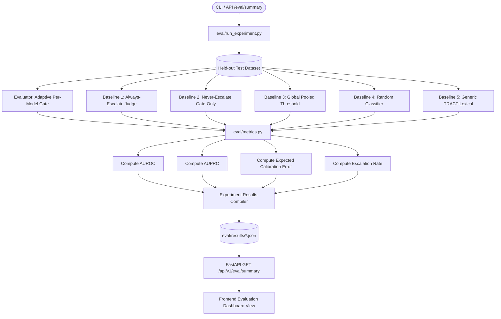
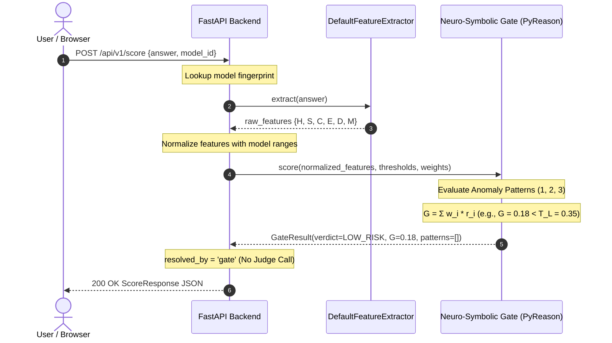
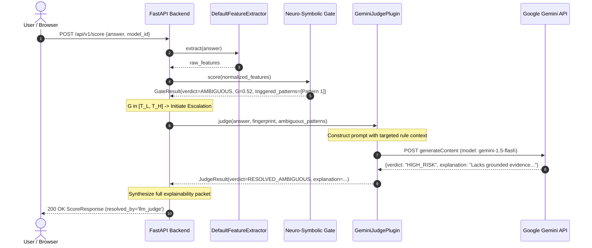
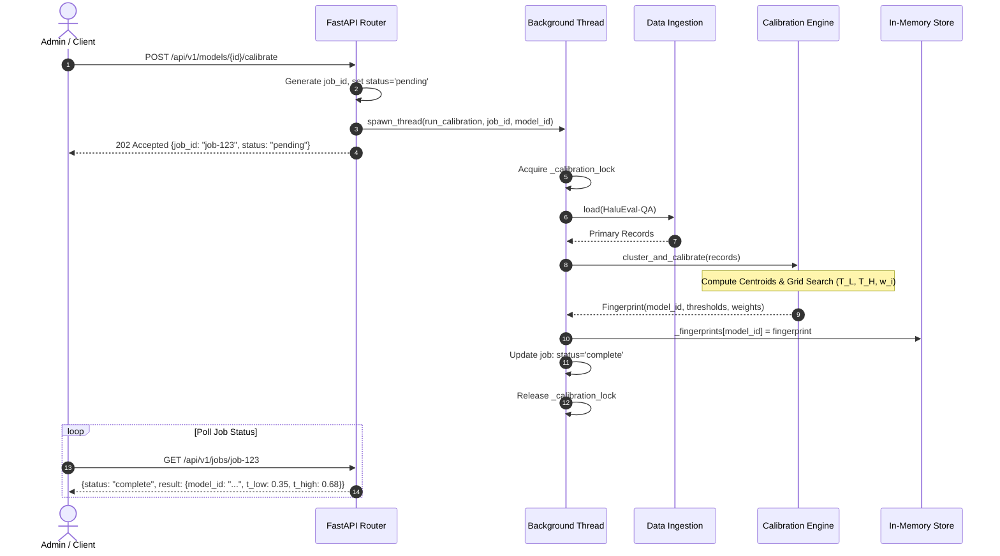
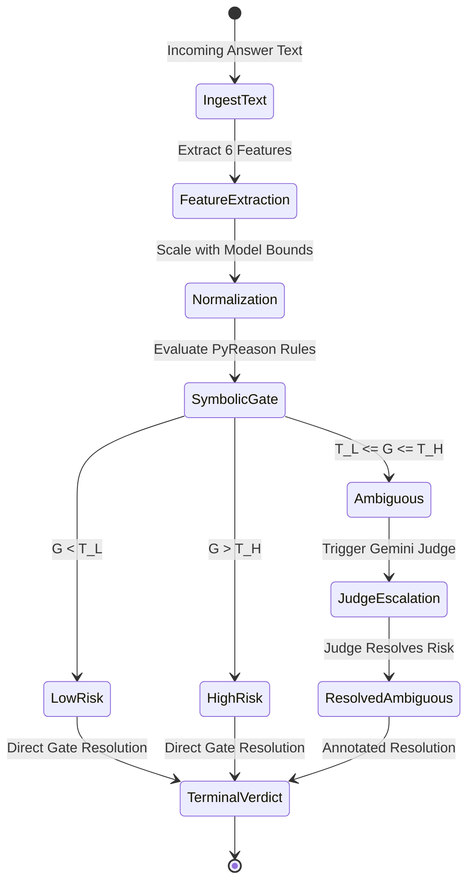
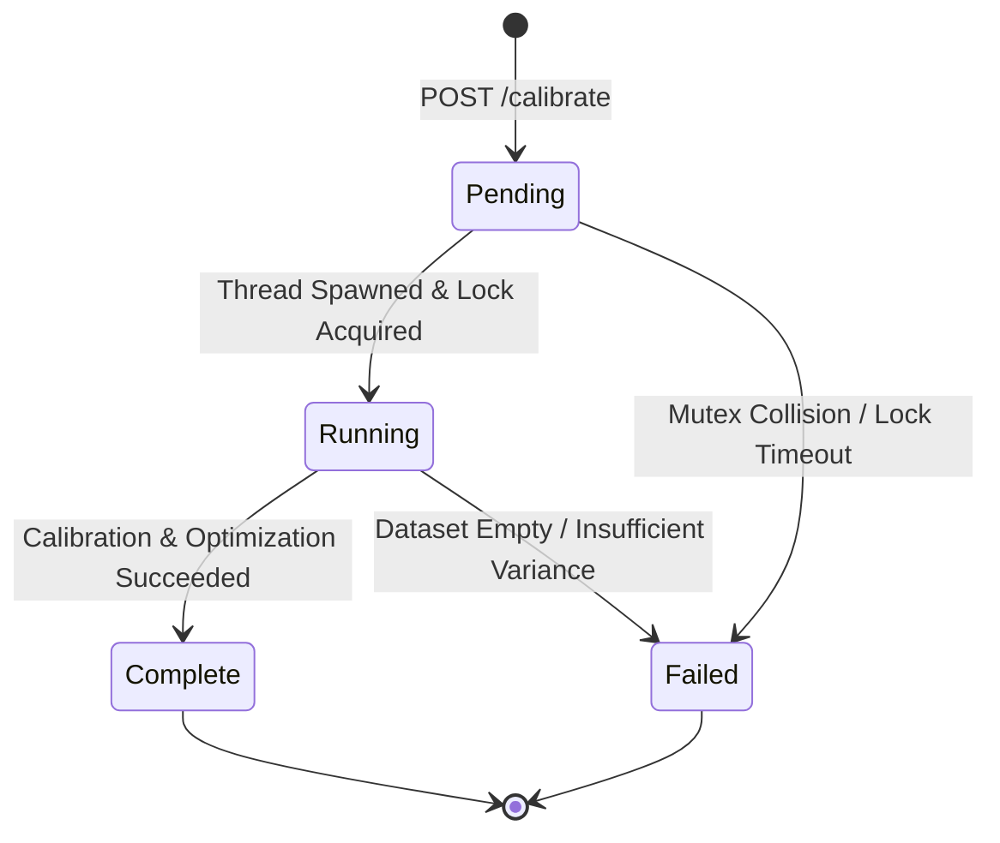

# System Dataflow Architecture (DATAFLOW)

## Project: Hallucination Fingerprinting Gate (HFG)
### Subtitle: Complete Dataflow, State Transitions, and Sequence Architecture
**Document Version:** 2.0  
**Status:** Implemented & Verified  
**Target Audience:** System Architects, Backend Engineers, Frontend Engineers, ML Researchers  

---

## 1. High-Level System Dataflow Overview

The Hallucination Fingerprinting Gate processes information through three distinct execution flows:
1. **Real-Time Scoring Pipeline (Inference Dataflow)**: Synchronous evaluation of LLM answers through the 3-stage gate.
2. **Model Calibration Pipeline (Training / Profiling Dataflow)**: Asynchronous computation of behavioral fingerprints and optimal decision thresholds.
3. **Evaluation Benchmark Pipeline (Experimentation Dataflow)**: Offline evaluation of baseline models and computation of AUROC / AUPRC / ECE metrics.

```
┌────────────────────────────────────────────────────────────────────────────────────────┐
│                                 HIGH-LEVEL DATA PIPELINE                               │
└────────────────────────────────────────────────────────────────────────────────────────┘

    [ Raw Answer Text ] + [ Model ID ]
              │
              ▼
    ┌─────────────────────────┐
    │ Stage 1: Telemetry      │ ──► Extracts 6 raw features: [H, S, C, E, D, M]
    │ Feature Extraction      │
    └───────────┬─────────────┘
                │
                ▼
    ┌─────────────────────────┐
    │ Feature Normalization   │ ──► Scaled to [0, 1] using Model Fingerprint Min/Max
    └───────────┬─────────────┘
                │
                ▼
    ┌─────────────────────────┐
    │ Stage 2: Neuro-Symbolic │ ──► Evaluates 3 relational rules via PyReason
    │ Decision Gate           │ ──► Computes aggregate score: G = Σ w_i * r_i
    └───────────┬─────────────┘
                │
        ┌───────┴──────────────────────────────┐
        │                                      │
   [ G < T_L or G > T_H ]               [ T_L ≤ G ≤ T_H ]
        │                                      │
        ▼ (Fast Path)                          ▼ (Escalation Path)
  LOW_RISK / HIGH_RISK                 ┌─────────────────────────┐
        │                              │ Stage 3: LLM Judge      │ (Gemini 1.5/2.0 API)
        │                              │ Escalation              │ Injects ambiguous rules
        │                              └───────────┬─────────────┘
        │                                          │
        │                                          ▼
        │                                 RESOLVED_AMBIGUOUS
        │                                          │
        └──────────────────┬───────────────────────┘
                           ▼
              [ Unified ScoreResponse JSON ]
                           │
                           ▼
          [ Frontend "Signal Forensics" UI ]
```

---

## 2. Detailed Dataflow Pipelines

---

### Pipeline 1: Real-Time Answer Scoring Pipeline (`POST /api/v1/score`)

This flow processes an incoming candidate answer from an HTTP client and returns an explainable risk verdict.

```mermaid
flowchart TD
    Client([HTTP Client / Frontend]) -->|1. POST /api/v1/score\n{answer, model_id}| FastAPI[FastAPI Route Handler]
    
    FastAPI -->|2. Lookup Fingerprint| FPStore[(In-Memory Fingerprint Store)]
    FPStore -->|Model Fingerprint Found| FastAPI
    FPStore -.->|Model Not Found| Err[Raise UncalibratedModelError 404]
    
    FastAPI -->|3. Extract Telemetry| Extractor[DefaultFeatureExtractor]
    Extractor -->|Lexicon Match| F_H[H: Hedge Density]
    Extractor -->|SpaCy NER & Regex| F_S[S: Specificity]
    Extractor -->|Pattern Proximity| F_C[C: Citation Vagueness]
    Extractor -->|Entity Co-occurrence| F_E[E: Evidence Density]
    Extractor -->|SentenceTransformers| F_D[D: Semantic Drift]
    Extractor -->|Lexicon Match| F_M[M: Confidence Marker]
    
    F_H & F_S & F_C & F_E & F_D & F_M -->|Raw Feature Vector| Normalizer[Min-Max Normalizer]
    Normalizer -->|Normalized Vector [0, 1]^6| Gate[PyReason Neuro-Symbolic Gate]
    
    Gate -->|Evaluate Pattern 1| P1[Anomaly Pattern 1: Evasive]
    Gate -->|Evaluate Pattern 2| P2[Anomaly Pattern 2: Over-Specific]
    Gate -->|Evaluate Pattern 3| P3[Anomaly Pattern 3: Drift/Overconfidence]
    
    P1 & P2 & P3 -->|Weighted Sum G = Σ w_i * r_i| ScoreCalc[Gate Score G]
    
    ScoreCalc --> Branch{Evaluate G vs\n(T_L, T_H)}
    
    Branch -->|G < T_L| LowRisk[Verdict: LOW_RISK\nresolved_by: 'gate']
    Branch -->|G > T_H| HighRisk[Verdict: HIGH_RISK\nresolved_by: 'gate']
    
    Branch -->|T_L <= G <= T_H| Escalate[Escalate to Stage 3]
    
    Escalate -->|Synthesize Prompt with Rule Activations| Judge[GeminiJudgePlugin / MockJudge]
    Judge -->|Call Gemini API / Local Fallback| JudgeRes[LLM Judge Analysis]
    JudgeRes --> ResAmb[Verdict: RESOLVED_AMBIGUOUS\nresolved_by: 'llm_judge']
    
    LowRisk & HighRisk & ResAmb --> Aggregator[Response Synthesizer]
    Aggregator -->|JSON Response| Client
```

#### Step-by-Step Data Transformations (Inference)

| Stage | Data Input | Component | Output Data Representation |
| :--- | :--- | :--- | :--- |
| **Input** | Raw JSON | FastAPI Router | `ScoreRequest(answer=str, model_id=str)` |
| **Extraction** | Answer string | `DefaultFeatureExtractor` | `dict[str, float]`: `{H: 1.25, S: 0.42, C: 0.0, E: 0.67, D: 0.03, M: 0.85}` |
| **Normalization** | Raw dict + Model bounds | `normalize_features()` | `dict[str, float]` with values strictly bounded in `[0.0, 1.0]` |
| **Symbolic Gate** | Normalized dict | `score_answer()` (PyReason) | `G: float`, `triggered_patterns: list[dict]`, initial verdict |
| **Escalation** (if needed) | Text + Triggered Patterns | `GeminiJudgePlugin` | `JudgeResult(verdict=str, confidence=float, explanation=str)` |
| **Output** | Verdict + Telemetry | Pydantic Serializer | `ScoreResponse` JSON schema |

---

### Pipeline 2: Offline Model Calibration Pipeline (`POST /api/v1/models/{id}/calibrate`)

This asynchronous pipeline calculates the behavioral baseline for a model from training records.

```mermaid
flowchart TD
    Req([Admin / POST /api/v1/models/{id}/calibrate]) --> FastApi[FastAPI Router]
    FastApi --> JobInit[Initialize Job Entry: status='pending']
    FastApi --> Spawn[Spawn Background Worker Thread]
    FastApi -->|Return job_id immediately| Req
    
    Spawn --> LockCheck{Acquire _calibration_lock}
    LockCheck -->|Lock Acquired| JobRunning[Set Job Status: 'running']
    LockCheck -.->|Already Active| JobConflict[Mark status='failed': Conflict]
    
    JobRunning --> DataLoader[HaluEval QA Loader]
    DataLoader --> Filter[ensure_primary_only Filter]
    Filter -->|Filtered Records| BatchExtractor[Batch Feature Extractor]
    
    BatchExtractor --> Mat[Feature Matrix N x 6]
    
    Mat --> Cluster[K-Means / GMM Clustering]
    Cluster --> Centroids[Compute Factual & Hallucinated Centroids]
    
    Mat --> Splitter[Train / Val Splitter]
    Splitter --> GridSearch[Grid Search Threshold Optimizer]
    
    GridSearch -->|Optimize Objective L = AUROC - λ * EscRate| OptParams[Optimal T_L, T_H, w_i]
    
    Centroids & OptParams --> Assembler[Assemble Fingerprint Object]
    Assembler --> SaveMem[(In-Memory _fingerprints)]
    Assembler --> SaveDisk[(Persist to configs/fingerprints/*.json)]
    
    SaveMem & SaveDisk --> JobDone[Set Job Status: 'complete', result=summary]
    JobDone --> ReleaseLock[Release _calibration_lock]
```

---

### Pipeline 3: Evaluation Benchmark Pipeline (`GET /api/v1/eval/summary`)

This flow powers the research validation dashboard, comparing the adaptive gate against standard baseline algorithms.



---

## 3. Sequence Diagrams

### 3.1 Fast-Path Scoring Sequence (Clean or Obvious Hallucination)

When the anomaly score falls outside the ambiguous band ($G < T_L$ or $G > T_H$), the response resolves in a single rapid pass without external LLM calls.



---

### 3.2 Escalated Scoring Sequence (Ambiguous Verdict)

When the anomaly score falls into the ambiguous band ($T_L \le G \le T_H$), the gate delegates to Stage 3 for deeper semantic analysis.



---

### 3.3 Asynchronous Model Calibration Job Sequence



---

## 4. State Transition Models

### 4.1 Gate Score Decision State Machine



### 4.2 Background Calibration Job Lifecycle



---

## 5. Detailed Schema & Payload Specifications

### 5.1 Request Payload: `POST /api/v1/score`
```json
{
  "answer": "The Apollo 11 mission was definitely the most celebrated lunar landing, reportedly confirmed by studies show in 1969.",
  "model_id": "meta-llama/Llama-2-7b-chat-hf"
}
```

### 5.2 Intermediate Telemetry Feature Extraction Vector
```json
{
  "H": 0.0,
  "S": 0.1875,
  "C": 1.0,
  "E": 0.5,
  "D": 0.0,
  "M": 5.55
}
```

### 5.3 Normalized Vector ($[0, 1]^6$)
```json
{
  "H": 0.0,
  "S": 0.28,
  "C": 0.50,
  "E": 0.55,
  "D": 0.0,
  "M": 0.86
}
```

### 5.4 Final Response Payload: `ScoreResponse`
```json
{
  "verdict": "RESOLVED_AMBIGUOUS",
  "gate_score": 0.54,
  "thresholds": {
    "t_low": 0.32,
    "t_high": 0.65
  },
  "resolved_by": "llm_judge",
  "triggered_patterns": [
    {
      "name": "anomaly_pattern_1",
      "features_involved": ["citation_vague", "hedging_high"],
      "strength": 0.50
    }
  ],
  "feature_breakdown": {
    "H": 0.0,
    "S": 0.1875,
    "C": 1.0,
    "E": 0.5,
    "D": 0.0,
    "M": 5.55
  },
  "explanation": "The response makes an unanchored gesture to authority ('studies show') without citing a credible historical or scientific publication.",
  "explanation_source": "llm_judge",
  "model_id": "meta-llama/Llama-2-7b-chat-hf",
  "fingerprint_version": "v1.0.0"
}
```
