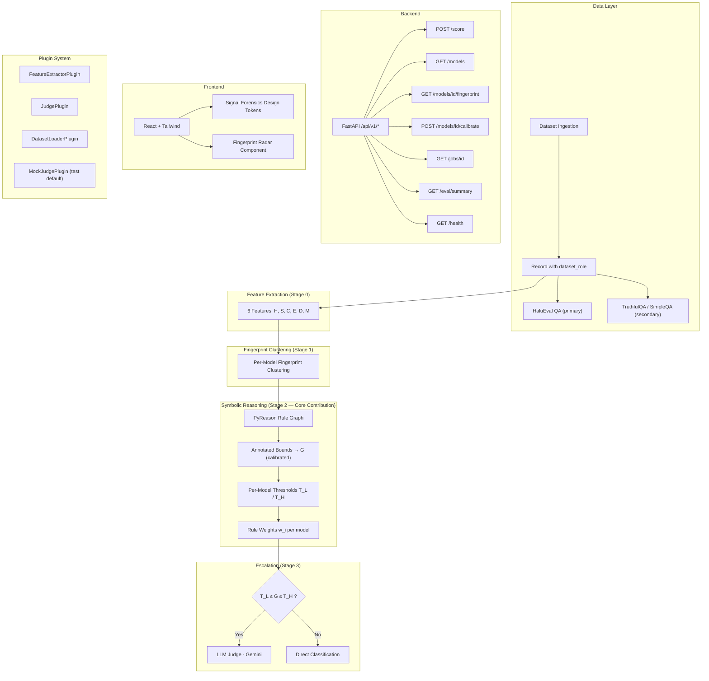

# DISCOVERY REPORT — Hallucination Fingerprinting System

**Date**: 2026-08-29  
**Phase**: A — Discovery  
**Role**: Principal Architect  
**Repository**: `/home/rishil-n/AI_PROJECT`

---

## 1. Current Repository State

The repository is **effectively empty**. It was created on 2026-08-29 at 11:49 and contains exactly one file:

```
AI_PROJECT/
└── docs/
    └── Hallucination_Fingerprinting_Master_Spec_v2.md   (0 bytes — EMPTY)
```

| Attribute | Status |
|---|---|
| Git initialized | ❌ No `.git` directory |
| Git history | ❌ None |
| Source code | ❌ None |
| Tests | ❌ None |
| Configuration files | ❌ None (`pyproject.toml`, `package.json`, `Dockerfile`, etc.) |
| Python dependencies | ❌ No `requirements.txt`, `pyproject.toml`, `setup.py`, or `Pipfile` |
| Frontend dependencies | ❌ No `package.json`, `vite.config.*`, `tailwind.config.*` |
| Scripts | ❌ None |
| Data directories | ❌ None |
| Notebooks | ❌ None |
| Experiment outputs | ❌ None |
| `docs/decisions.md` | ❌ Does not exist |
| Hidden files | ❌ None (no `.env`, `.gitignore`, `.editorconfig`, etc.) |

> [!CAUTION]
> The master specification file `docs/Hallucination_Fingerprinting_Master_Spec_v2.md` is **0 bytes** — completely empty. The specification text that drives this project does not exist in the repository. All analysis below is based on the detailed load-bearing elements enumerated in the Phase A discovery prompt.

---

## 2. Current Architecture (Actual vs. Spec)

### What the Spec Describes (inferred from prompt)

The specification envisions a multi-stage hallucination detection system with these major architectural layers:



### What Actually Exists

**Nothing.** The repository contains zero implementation artifacts. There is no architecture to analyze.

---

## 3. Existing Components

| Component | Status |
|---|---|
| *None* | The repository contains no implemented components. |

There is literally nothing to reuse. The project must be built from scratch.

---

## 4. Missing Components

> [!IMPORTANT]
> **Every single component specified in the project is missing.** This is a greenfield build.

### 4.1 Data Layer
- [ ] Dataset ingestion pipeline
- [ ] `Record` data model with `dataset_role` field (`"primary"` | `"secondary"`)
- [ ] HaluEval QA subset loader (`qa_data.json`) → `dataset_role = "primary"`
- [ ] TruthfulQA loader → `dataset_role = "secondary"`
- [ ] SimpleQA loader → `dataset_role = "secondary"`
- [ ] `data/` directory structure

### 4.2 Feature Extraction (Stage 0)
- [ ] Feature **H** — Hedge density
- [ ] Feature **S** — Specificity
- [ ] Feature **C** — Citation vagueness
- [ ] Feature **E** — Evidence density
- [ ] Feature **D** — Semantic/entity drift
- [ ] Feature **M** — Confidence-marker density
- [ ] `FeatureExtractorPlugin` interface

### 4.3 Fingerprint Clustering (Stage 1)
- [ ] Per-model fingerprint clustering logic
- [ ] Fingerprint storage/serialization

### 4.4 Symbolic Reasoning — PyReason (Stage 2, Core Contribution)
- [ ] PyReason rule graph definition
- [ ] Annotated bounds computation (NOT native hallucination probability)
- [ ] **G** — the composite score defined and calibrated by this system
- [ ] Per-model calibrated thresholds **T_L** / **T_H** (NOT a single global threshold)
- [ ] Per-model rule weights **w_i**
- [ ] Calibration pipeline

### 4.5 LLM Judge Escalation (Stage 3)
- [ ] Escalation logic: invoke judge ONLY when `T_L ≤ G ≤ T_H`
- [ ] Gemini-based `JudgePlugin` implementation
- [ ] `MockJudgePlugin` for tests/local development
- [ ] `JudgePlugin` interface

### 4.6 Backend (FastAPI)
- [ ] FastAPI application scaffold
- [ ] `POST /api/v1/score`
- [ ] `GET  /api/v1/models`
- [ ] `GET  /api/v1/models/{id}/fingerprint`
- [ ] `POST /api/v1/models/{id}/calibrate`
- [ ] `GET  /api/v1/jobs/{id}`
- [ ] `GET  /api/v1/eval/summary`
- [ ] `GET  /api/v1/health`

### 4.7 Frontend (React + Tailwind)
- [ ] React application scaffold
- [ ] Tailwind configuration
- [ ] **Signal Forensics** design tokens:
  - graphite (background)
  - paper (surface)
  - signal-teal `#4FE3C1`
  - signal-amber `#F2B84B`
  - signal-coral `#FF6B4A`
- [ ] Typography: Space Grotesk / Inter / JetBrains Mono
- [ ] **Fingerprint Radar** signature visualization component
- [ ] Dashboard / model explorer views

### 4.8 Plugin System
- [ ] `FeatureExtractorPlugin` interface
- [ ] `JudgePlugin` interface
- [ ] `DatasetLoaderPlugin` interface
- [ ] Plugin registration/discovery mechanism

### 4.9 Infrastructure & Configuration
- [ ] `pyproject.toml` or `requirements.txt`
- [ ] `package.json`
- [ ] `Dockerfile` / `docker-compose.yml`
- [ ] `.gitignore`
- [ ] `.env.example`
- [ ] Git initialization
- [ ] Test infrastructure (`pytest.ini`, `conftest.py`, `vitest.config.*`)
- [ ] CI/CD pipeline
- [ ] `docs/decisions.md`

---

## 5. Broken Components

No components exist, therefore nothing is broken. However:

> [!WARNING]
> The specification file itself is broken — `docs/Hallucination_Fingerprinting_Master_Spec_v2.md` is **0 bytes**. This is the single most critical blocker. Without the written spec in the repo, there is no authoritative source of truth for implementors, reviewers, or future contributors.

---

## 6. Dependencies (Present / Missing)

### 6.1 Python Dependencies (ALL MISSING)

| Package | Purpose | Status |
|---|---|---|
| `fastapi` | Backend API framework | ❌ Missing |
| `uvicorn` | ASGI server | ❌ Missing |
| `pydantic` | Data validation / Record models | ❌ Missing |
| `pyreason` | Symbolic reasoning rule graph (Stage 2) | ❌ Missing |
| `scikit-learn` | Clustering (Stage 1), calibration | ❌ Missing |
| `numpy` / `pandas` | Numerical computation, data manipulation | ❌ Missing |
| `spacy` | NLP for feature extraction (H, S, C, E, D, M) | ❌ Missing |
| `sentence-transformers` | Semantic drift (feature D) | ❌ Missing |
| `google-generativeai` | Gemini LLM judge | ❌ Missing |
| `datasets` (HuggingFace) | Loading TruthfulQA, possibly HaluEval | ❌ Missing |
| `pytest` | Testing | ❌ Missing |
| `httpx` | Async test client for FastAPI | ❌ Missing |

### 6.2 Frontend Dependencies (ALL MISSING)

| Package | Purpose | Status |
|---|---|---|
| `react` / `react-dom` | UI framework | ❌ Missing |
| `vite` | Build tool | ❌ Missing |
| `tailwindcss` | Utility CSS | ❌ Missing |
| `@fontsource/space-grotesk` | Typography | ❌ Missing |
| `@fontsource/inter` | Typography | ❌ Missing |
| `@fontsource/jetbrains-mono` | Typography | ❌ Missing |
| `recharts` or `d3` | Radar chart visualization | ❌ Missing |
| `axios` or `fetch` wrapper | API client | ❌ Missing |
| `react-router-dom` | Routing | ❌ Missing |
| `vitest` / `@testing-library/react` | Testing | ❌ Missing |

### 6.3 System-Level Dependencies (STATUS UNKNOWN)

| Dependency | Notes |
|---|---|
| Python 3.10+ | Not verified — no `pyproject.toml` to declare requirement |
| Node.js 18+ | Not verified |
| CUDA / GPU | May be needed for sentence-transformers; not specified |

---

## 7. Research Risks

> [!WARNING]
> These risks are significant because this appears to be a research-contribution project, not just an engineering build.

| # | Risk | Severity | Details |
|---|---|---|---|
| R1 | **PyReason integration novelty** | 🔴 High | PyReason is a relatively niche symbolic reasoning library. Integrating it as the core contribution layer that produces annotated bounds (NOT probabilities) requires careful design. Misunderstanding PyReason's output semantics would invalidate the entire Stage 2 contribution. |
| R2 | **Per-model calibration validity** | 🔴 High | The spec demands per-model thresholds T_L/T_H and per-model rule weights w_i. This requires sufficient per-model data. If the evaluation datasets are small per-model, calibration may overfit or be statistically insignificant. |
| R3 | **Feature validity (H, S, C, E, D, M)** | 🟡 Medium | The six features must be grounded in linguistic/NLP theory. Hedge density (H) and confidence-marker density (M) could overlap. Citation vagueness (C) assumes citations exist in the text. Feature definitions need precise operationalization. |
| R4 | **Fingerprint clustering reproducibility** | 🟡 Medium | Per-model fingerprint clustering (Stage 1) results depend on clustering hyperparameters, distance metrics, and feature normalization. Without reproducibility controls, results may not be replicable. |
| R5 | **LLM judge consistency** | 🟡 Medium | Using Gemini as the escalation judge introduces non-determinism. Without temperature=0, seed pinning, and prompt versioning, evaluation results will vary across runs. |
| R6 | **Dataset role distinction validity** | 🟡 Medium | The primary/secondary dataset split implies a transfer-learning or generalization claim. This needs clear justification — why HaluEval QA is primary and TruthfulQA/SimpleQA are secondary-only must be defended in the paper. |
| R7 | **G calibration circularity** | 🟡 Medium | G is "defined and calibrated by this system" from PyReason bounds. If the calibration target is derived from the same labeled data used to set the bounds, there's a risk of circular reasoning. |

---

## 8. Engineering Risks

| # | Risk | Severity | Details |
|---|---|---|---|
| E1 | **Empty specification file** | 🔴 Critical | The spec is 0 bytes. Without the authoritative spec text, implementation decisions have no ground truth to validate against. |
| E2 | **No version control** | 🔴 High | No `.git` directory. No change tracking, no branching, no rollback capability. |
| E3 | **Greenfield complexity** | 🔴 High | Building the entire system from zero — data layer, 6 NLP features, PyReason integration, clustering, calibration, FastAPI backend with 7+ endpoints, React frontend with custom design system, plugin architecture — is a very large scope. |
| E4 | **PyReason availability & API stability** | 🟡 Medium | PyReason's Python API may have breaking changes. Need to pin version and verify it supports the annotated-bounds workflow described. |
| E5 | **Gemini API key management** | 🟡 Medium | The LLM judge requires API credentials. No `.env` structure exists. Need secure key management from day one, with MockJudgePlugin as the safe fallback. |
| E6 | **Heavy NLP dependencies** | 🟡 Medium | spaCy models, sentence-transformers models, and potentially Gemini API calls make the feature extraction pipeline heavy. Local development may be slow without GPU or model caching. |
| E7 | **Frontend-backend contract coupling** | 🟡 Medium | The exact `/api/v1/*` contract must be defined as an OpenAPI schema before frontend development begins, or the two will drift. |

---

## 9. Specification Mismatches

> [!IMPORTANT]
> Since the specification file is empty (0 bytes), there are technically no spec "sections" to cite. However, the user's prompt enumerates the load-bearing elements that the spec is supposed to contain. Below, I compare the repository state against those enumerated requirements.

| # | Spec Element (from prompt) | Repository State | Mismatch |
|---|---|---|---|
| S1 | `dataset_role` field on every ingested Record (`"primary"` \| `"secondary"`) | No Record model exists | **MISSING** — not implemented |
| S2 | HaluEval QA subset (`qa_data.json`) as primary | No data loader exists | **MISSING** — not implemented |
| S3 | TruthfulQA / SimpleQA as secondary-only | No data loader exists | **MISSING** — not implemented |
| S4 | Six features: H, S, C, E, D, M | No feature extractors exist | **MISSING** — not implemented |
| S5 | Per-model fingerprint clustering (Stage 1) | No clustering code exists | **MISSING** — not implemented |
| S6 | PyReason rule graph producing annotated bounds (NOT probability) | No PyReason integration exists | **MISSING** — not implemented |
| S7 | G defined and calibrated by the system | No G computation exists | **MISSING** — not implemented |
| S8 | Per-model T_L / T_H and w_i (NOT global threshold) | No calibration exists | **MISSING** — not implemented |
| S9 | LLM judge (Gemini) invoked ONLY when T_L ≤ G ≤ T_H | No escalation logic exists | **MISSING** — not implemented |
| S10 | FastAPI `/api/v1/*` contract (7 endpoints) | No backend exists | **MISSING** — not implemented |
| S11 | Plugin interfaces: FeatureExtractorPlugin, JudgePlugin, DatasetLoaderPlugin | No plugin system exists | **MISSING** — not implemented |
| S12 | MockJudgePlugin as safe default | No mock exists | **MISSING** — not implemented |
| S13 | React + Tailwind with "Signal Forensics" design tokens | No frontend exists | **MISSING** — not implemented |
| S14 | Exact color tokens: graphite, paper, signal-teal `#4FE3C1`, signal-amber `#F2B84B`, signal-coral `#FF6B4A` | No frontend exists | **MISSING** — not implemented |
| S15 | Typography: Space Grotesk / Inter / JetBrains Mono | No frontend exists | **MISSING** — not implemented |
| S16 | Fingerprint Radar signature component | No component exists | **MISSING** — not implemented |
| S17 | Spec file itself (`Hallucination_Fingerprinting_Master_Spec_v2.md`) | 0 bytes — empty | **BROKEN** — file exists but has no content |

**Summary**: 16 of 16 load-bearing elements are completely missing. 1 (the spec file) is structurally broken (exists but empty).

---

## 10. Recommended Next Implementation Step

> [!IMPORTANT]
> **Phase B should begin with two prerequisites, then the foundational layers:**

### Step 0: Critical Prerequisites
1. **Populate the specification file** — `docs/Hallucination_Fingerprinting_Master_Spec_v2.md` must contain the full, authoritative specification text. Without it, all implementation decisions are ungrounded.
2. **Initialize git** — `git init`, create `.gitignore`, make the initial commit.

### Step 1: Project Scaffold
3. Create the Python project structure (`pyproject.toml`, `src/` layout)
4. Create the frontend project structure (`package.json`, Vite + React + Tailwind)
5. Define core data models — especially the `Record` model with `dataset_role`
6. Define plugin interfaces (`FeatureExtractorPlugin`, `JudgePlugin`, `DatasetLoaderPlugin`)

### Step 2: Bottom-Up Core Pipeline
7. Implement the six feature extractors (H, S, C, E, D, M)
8. Implement dataset loaders (HaluEval QA primary, TruthfulQA/SimpleQA secondary)
9. Implement per-model fingerprint clustering (Stage 1)
10. Integrate PyReason rule graph and annotated bounds → G (Stage 2)
11. Implement per-model calibration pipeline for T_L/T_H and w_i
12. Implement MockJudgePlugin, then Gemini JudgePlugin with escalation logic

### Step 3: API & Frontend
13. Build FastAPI backend with the exact `/api/v1/*` contract
14. Build React frontend with Signal Forensics design tokens and Fingerprint Radar

---

## 11. Files Likely to Change in Phase B

Since this is a greenfield build, Phase B will **create** files rather than modify them. Expected new files:

```
AI_PROJECT/
├── .gitignore
├── .env.example
├── pyproject.toml
├── README.md
├── docs/
│   ├── Hallucination_Fingerprinting_Master_Spec_v2.md  ← POPULATE (currently empty)
│   └── decisions.md                                     ← CREATE
├── src/
│   └── hallucination_fingerprinting/
│       ├── __init__.py
│       ├── models/
│       │   ├── __init__.py
│       │   └── record.py                                ← Record + dataset_role
│       ├── features/
│       │   ├── __init__.py
│       │   ├── base.py                                  ← FeatureExtractorPlugin
│       │   ├── hedge_density.py                         ← H
│       │   ├── specificity.py                           ← S
│       │   ├── citation_vagueness.py                    ← C
│       │   ├── evidence_density.py                      ← E
│       │   ├── semantic_drift.py                        ← D
│       │   └── confidence_markers.py                    ← M
│       ├── fingerprint/
│       │   ├── __init__.py
│       │   └── clustering.py                            ← Stage 1
│       ├── reasoning/
│       │   ├── __init__.py
│       │   ├── pyreason_graph.py                        ← Stage 2 rule graph
│       │   └── calibration.py                           ← T_L/T_H, w_i
│       ├── judge/
│       │   ├── __init__.py
│       │   ├── base.py                                  ← JudgePlugin interface
│       │   ├── gemini_judge.py                          ← Gemini implementation
│       │   ├── mock_judge.py                            ← MockJudgePlugin
│       │   └── escalation.py                            ← T_L ≤ G ≤ T_H logic
│       ├── datasets/
│       │   ├── __init__.py
│       │   ├── base.py                                  ← DatasetLoaderPlugin
│       │   ├── halueval_loader.py                       ← Primary
│       │   ├── truthfulqa_loader.py                     ← Secondary
│       │   └── simpleqa_loader.py                       ← Secondary
│       └── api/
│           ├── __init__.py
│           ├── app.py                                   ← FastAPI application
│           ├── routes/
│           │   ├── score.py
│           │   ├── models.py
│           │   ├── jobs.py
│           │   ├── eval.py
│           │   └── health.py
│           └── schemas.py                               ← Request/response models
├── tests/
│   ├── conftest.py
│   ├── test_features/
│   ├── test_fingerprint/
│   ├── test_reasoning/
│   ├── test_judge/
│   ├── test_datasets/
│   └── test_api/
├── frontend/
│   ├── package.json
│   ├── vite.config.ts
│   ├── tailwind.config.ts                               ← Signal Forensics tokens
│   ├── tsconfig.json
│   ├── index.html
│   ├── src/
│   │   ├── App.tsx
│   │   ├── main.tsx
│   │   ├── styles/
│   │   │   └── globals.css                              ← Font imports
│   │   ├── components/
│   │   │   └── FingerprintRadar.tsx                     ← Radar signature component
│   │   ├── pages/
│   │   └── api/
│   │       └── client.ts
│   └── tests/
├── data/
│   └── .gitkeep
├── scripts/
│   └── download_datasets.py
└── docker-compose.yml
```

---

## 12. Files That Should Remain Untouched

| File | Reason |
|---|---|
| `docs/Hallucination_Fingerprinting_Master_Spec_v2.md` | Should be **populated** but its path and name must not change — it is the canonical spec location referenced by the project structure. Once populated, its content should be treated as the authoritative source of truth and only updated through explicit spec revision processes. |

> [!NOTE]
> Since the repository has no other files, there is nothing else to protect. Once Phase B begins creating files, this list will grow to include foundational interfaces and data models that downstream components depend on.

---

## Summary

This is a **complete greenfield build**. The repository contains nothing except an empty specification file. Every load-bearing element from the spec — data models, features, clustering, PyReason integration, calibration, escalation logic, API, frontend, plugins — must be built from zero.

**The single most critical blocker is the empty spec file.** Before any implementation begins, `docs/Hallucination_Fingerprinting_Master_Spec_v2.md` must be populated with the full specification text, and the repository must be placed under version control.

**STOP — Phase A Discovery complete.**
