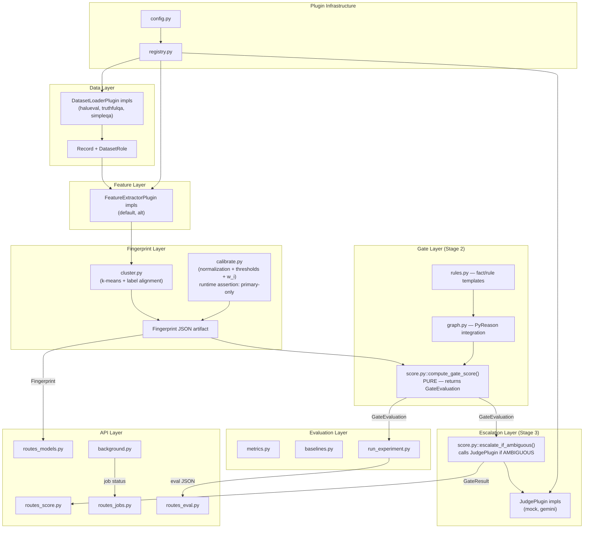

# FINAL ARCHITECTURE — Hallucination Fingerprinting System

**Date**: 2026-08-29  
**Phase**: B — Final Architecture (Reconciled)  
**Role**: Principal Architect  
**Spec**: [Claude Text v2.md](file:///home/rishil-n/Documents/Interview%20Perp/Claude%20Text%20v2.md) — the authoritative source for all design decisions

---

## Audit Reconciliation

Two independent reviews produced 19 findings. Each is verified below against the proposed architecture and spec.

### Skeptical ML Review — 7 findings

| # | Finding | Disposition | Justification |
|---|---|---|---|
| S-C1 | Gate-judge coupling in `score.py` prevents isolated gate evaluation | ✅ **ACCEPT** | Correctness: Baseline 2 (never-escalate) and AUROC-on-G computation require gate scoring without judge invocation. The proposed `score_answer()` monolithically combines both, making these impossible without code duplication. Fix: split into `compute_gate_score()` and `escalate_if_ambiguous()`. |
| S-C2 | Python 3.14 compatibility | ✅ **ACCEPT (already addressed)** | Already Blocker 2 in Phase A final report. M0 says "test immediately, fall back to 3.10 venv." No architecture change needed. |
| S-H1 | Baseline 3 confounders — uniform w_i vs. learned, normalization | ✅ **PARTIALLY ACCEPT** | Research validity: Spec [L333](file:///home/rishil-n/Documents/Interview%20Perp/Claude%20Text%20v2.md#L333) says "global pooled `(T_L, T_H, w_i)`" — the w_i must also be *learned* globally, not uniform. The original proposal's M5 incorrectly specifies "uniform w_i". Fix: Baseline 3 learns global w_i via grid search on pooled data. Ablation B separately tests learned-vs-uniform. **REJECT** the normalization confounder: spec [L106](file:///home/rishil-n/Documents/Interview%20Perp/Claude%20Text%20v2.md#L106) defines per-model normalization as a prerequisite feature-engineering step ("part of what makes the fingerprint per-model"), not a variable under test. Both global and adaptive gates use per-model normalization. |
| S-H2 | No type-level enforcement of `dataset_role` in calibration | ✅ **PARTIALLY ACCEPT** | Correctness: A runtime assertion in `calibrate.py` that raises `ValueError` if any record has `dataset_role != PRIMARY` is the right guard — cheap, explicit, testable. **REJECT** the `PrimaryRecord` subclass — unnecessary abstraction that fragments the data model without adding safety beyond the runtime check. |
| S-M1 | Model identity leakage to judge | ✅ **ACCEPT** | Research validity: Spec [L146](file:///home/rishil-n/Documents/Interview%20Perp/Claude%20Text%20v2.md#L146) says prompt includes "the model's fingerprint summary" but does not require including model_id by name. If the judge knows the model is "chatgpt", its parametric priors about ChatGPT's reliability become a confounder. Fix: anonymize model_id in judge prompts (replace with opaque identifier). |
| S-M2 | r_i extraction should be configurable | ✅ **ACCEPT** | Reproducibility: ADR-1 already defines `r_i = lower` with alternatives. Making the strategy configurable via YAML costs nothing and enables the ablation. |
| S-M3 | Add `resolved_direction` field to API | ❌ **REJECT** | Spec fidelity: Spec [L182–193](file:///home/rishil-n/Documents/Interview%20Perp/Claude%20Text%20v2.md#L182-L193) defines the exact API response schema. Adding fields not in the spec violates the "do not silently extend" principle. The `JudgeResult` internally carries the direction for logging; the API returns `RESOLVED_AMBIGUOUS` as designed. If needed, this is a future spec revision, not an implementation decision. |

### Adversarial Breaker Review — 12 findings

| # | Finding | Disposition | Justification |
|---|---|---|---|
| A-C1 | Judge failure returns fake `RESOLVED_AMBIGUOUS` | ✅ **ACCEPT** | Correctness + honesty: Spec [L151](file:///home/rishil-n/Documents/Interview%20Perp/Claude%20Text%20v2.md#L151) says "Never presents unverifiable LLM chain-of-thought as ground truth." Returning `resolved_by: "llm_judge"` when the judge crashed is dishonest. Fix: return HTTP 502 with `gate_score` and `gate_verdict: "AMBIGUOUS"` in the error body. The spec's 3-verdict enum has no honest way to represent "judge failed" — an HTTP error is the only clean option. |
| A-C2 | k-means cluster-label alignment hazard | ✅ **ACCEPT** | Correctness: k-means assigns arbitrary cluster IDs. Without alignment, cluster 0 could be "hallucination" for Model A and "correct" for Model B, corrupting the Fingerprint Radar and all downstream logic. Fix: after k-means, compute mean `label` per cluster; assign `"hallucination_region"` to the cluster with higher mean hallucination rate. |
| A-H1 | None crash on uncalibrated fingerprint | ✅ **ACCEPT** | Correctness: `classify(G, None, None)` raises `TypeError` in Python. The proposed error handling table lists `UncalibratedModelError` but the `score_answer()` pseudocode has no None-check before calling `classify()`. Fix: add explicit guard `if fingerprint.t_low is None or fingerprint.t_high is None: raise UncalibratedModelError(model_id)` before `classify()`. |
| A-H2 | Gemini API key exposure in error tracebacks | ✅ **ACCEPT** | Security: Spec [L453](file:///home/rishil-n/Documents/Interview%20Perp/Claude%20Text%20v2.md#L453) says "the Gemini API key must never be sent to or accessible from the frontend — server-side only, loaded from environment/secrets, never logged." The `google-generativeai` SDK can embed auth headers in exceptions. Fix: wrap all Gemini calls in a sanitizing try-except that catches SDK exceptions and returns generic error messages. |
| A-H3 | Empty `triggered_patterns` in judge prompt | ❌ **REJECT** | Mathematically impossible: `G = Σ w_i * r_i`. If all `r_i = 0`, then `G = 0`. For `G ≥ T_L > 0` (AMBIGUOUS), at least one `r_i > 0`, so at least one pattern is triggered. `triggered_patterns` cannot be empty when the verdict is AMBIGUOUS. Add a defensive `assert len(triggered_patterns) > 0` as documentation of this invariant. |
| A-M1 | Model identity leakage to judge | ✅ **ACCEPT (same as S-M1)** | Already accepted above. |
| A-M2 | Degenerate threshold handling | ✅ **PARTIALLY ACCEPT** | Correctness: The original proposal says "T_L ≥ T_H → set T_H = T_L + 0.05." This is necessary. Additionally constrain: `0.0 ≤ T_L < T_H ≤ 1.0` during calibration. **REJECT** the ε = 0.05 minimum band width as a hard constraint — for some models, a very narrow band may be optimal. Instead: log a warning if band < 0.05 but allow it. |
| A-M3 | Hardcoded `model_id = "chatgpt"` for HaluEval | ✅ **PARTIALLY ACCEPT** | Maintainability: HaluEval QA was generated by ChatGPT, so `"chatgpt"` is factually correct. But making `default_model_id` a configurable parameter in the loader is zero-cost and enables future datasets. |
| A-M4 | In-memory job store data loss | ❌ **REJECT** | Spec [L163](file:///home/rishil-n/Documents/Interview%20Perp/Claude%20Text%20v2.md#L163): "explicitly not designed, claimed, or engineered as a scalable, multi-tenant production system." Spec [L245](file:///home/rishil-n/Documents/Interview%20Perp/Claude%20Text%20v2.md#L245): "What NOT to build." Adding file persistence for job state is over-engineering for a single-user research demo. Document as a known limitation in README. |
| A-D1 | Decouple gate from escalation | ✅ **ACCEPT (same as S-C1)** | Already accepted above. |
| A-D2 | Async CPU offloading for embeddings | ❌ **REJECT** | This is a single-user research demo ([L163](file:///home/rishil-n/Documents/Interview%20Perp/Claude%20Text%20v2.md#L163)). The asyncio event loop will never be under concurrent load. Adding `to_thread()` is complexity for a non-existent problem. Document as a note if the app is ever scaled. |
| A-D3 | Structured `resolved_direction` field | ❌ **REJECT (same as S-M3)** | Already rejected above. |

### Summary: 12 accepted, 4 rejected, 3 partially accepted

---

## FINAL ARCHITECTURE

### Structural Changes from Original Proposal

The following changes are made based on the reconciliation above:

1. **Split `score.py`** into `compute_gate_score()` (pure, no side effects) and `escalate_if_ambiguous()` (calls judge)
2. **Baseline 3** learns global `w_i` (pooled, not uniform) — uniform w_i tested in Ablation B
3. **k-means clusters** post-hoc aligned using ground-truth label density
4. **Judge failure** → HTTP 502 (not fake `RESOLVED_AMBIGUOUS`)
5. **Model identity** anonymized in judge prompts
6. **Gemini exceptions** sanitized before reaching API responses
7. **Explicit None-check** before threshold comparison in scoring
8. **Threshold bounds** constrained: `0.0 ≤ T_L < T_H ≤ 1.0`
9. **`r_i` extraction** configurable via YAML (`lower` | `upper` | `midpoint`)
10. **Runtime assertion** in `calibrate.py` rejecting `dataset_role != PRIMARY`
11. **HaluEval `model_id`** configurable with default `"chatgpt"`

Everything else from the original proposal stands unchanged.

---

## FINAL INTERFACES

All interfaces verified against spec [5.12, L223–237](file:///home/rishil-n/Documents/Interview%20Perp/Claude%20Text%20v2.md#L223-L237). Field names unchanged from spec.

```python
# ═══════════════════════════════════════════════════
# Data Layer
# ═══════════════════════════════════════════════════

class DatasetRole(str, Enum):
    PRIMARY = "primary"
    SECONDARY = "secondary"

class Record(BaseModel):
    question: str
    answer: str
    model_id: str
    label: int                    # 0 = correct, 1 = hallucinated
    source_dataset: str           # "halueval_qa" | "truthfulqa" | "simpleqa"
    dataset_role: DatasetRole     # REQUIRED — Pydantic rejects if missing

# ═══════════════════════════════════════════════════
# Plugin Protocols (spec L224–237)
# ═══════════════════════════════════════════════════

class FeatureExtractorPlugin(Protocol):
    name: str
    def extract(self, answer: str) -> dict[str, float]: ...
    # Returns exactly {"H": float, "S": float, "C": float, "E": float, "D": float, "M": float}

class JudgeResult(BaseModel):
    verdict: str           # "LOW_RISK" | "HIGH_RISK" — judge's internal resolution
    explanation: str       # natural-language reasoning, labeled as model-generated
    confidence: float      # judge's self-reported confidence [0,1]

class JudgePlugin(Protocol):
    name: str
    def judge(
        self,
        answer: str,
        fingerprint_summary: dict,       # centroids, thresholds — NO model_id (anonymized)
        ambiguous_patterns: list[dict],   # triggered pattern dicts
    ) -> JudgeResult: ...

class DatasetLoaderPlugin(Protocol):
    name: str
    def load(self) -> Iterable[Record]: ...

# ═══════════════════════════════════════════════════
# Fingerprint (per-model artifact)
# ═══════════════════════════════════════════════════

class NormalizationParams(BaseModel):
    feature_mins: dict[str, float]    # {"H": 0.0, "S": 0.01, ...}
    feature_maxs: dict[str, float]    # {"H": 0.12, "S": 0.45, ...}

class ClusterInfo(BaseModel):
    centroids: list[dict[str, float]] # each centroid is {"H": .., "S": .., ...}
    cluster_labels: list[str]         # post-hoc aligned: ["correct_region", "hallucination_region"]

class Fingerprint(BaseModel):
    model_id: str
    version: str
    normalization: NormalizationParams
    clusters: ClusterInfo
    w_i: dict[str, float] | None      # {"anomaly_pattern_1": 0.4, ...} — None until calibrated
    t_low: float | None               # None until calibrated
    t_high: float | None              # None until calibrated
    calibration_dataset_size: int
    last_calibrated_at: str

# ═══════════════════════════════════════════════════
# Gate Output (two-stage: gate score + optional escalation)
# ═══════════════════════════════════════════════════

class TriggeredPattern(BaseModel):
    name: str                          # "anomaly_pattern_1"
    features_involved: list[str]       # ["H", "C"]
    strength: float                    # r_i for this pattern

class Thresholds(BaseModel):
    t_low: float
    t_high: float

# Stage 2 output — gate only, no judge involved
class GateEvaluation(BaseModel):
    gate_score: float                  # G
    gate_verdict: str                  # "LOW_RISK" | "HIGH_RISK" | "AMBIGUOUS" (internal)
    thresholds: Thresholds
    triggered_patterns: list[TriggeredPattern]
    feature_breakdown: dict[str, float]  # {"H", "S", "C", "E", "D", "M"} normalized
    raw_features: dict[str, float]       # unnormalized, for debugging/logging
    model_id: str
    fingerprint_version: str

# Final API output — after optional judge escalation
class GateResult(BaseModel):
    verdict: str                       # "LOW_RISK" | "HIGH_RISK" | "RESOLVED_AMBIGUOUS"
    gate_score: float                  # G
    thresholds: Thresholds
    resolved_by: str                   # "gate" | "llm_judge"
    triggered_patterns: list[TriggeredPattern]
    feature_breakdown: dict[str, float]  # {"H", "S", "C", "E", "D", "M"}
    explanation: str
    explanation_source: str            # "symbolic" | "llm_judge"
    model_id: str
    fingerprint_version: str
```

---

## FINAL DATA FLOW

```
Answer text + model_id
        │
        ▼
┌───────────────────────┐
│ Load Fingerprint       │ ← from data/processed/fingerprints/{model_id}_v{version}.json
│                        │   IF not found → HTTP 404 (UncalibratedModelError)
│                        │   IF t_low/t_high is None → HTTP 404 (UncalibratedModelError)
└───────────────────────┘
        │
        ▼
┌───────────────────────┐
│ FeatureExtractorPlugin │ → {"H": 0.08, "S": 0.32, "C": 0.65, "E": 0.21, "D": 0.44, "M": 0.12}
│ (via registry)         │   raw, unnormalized
└───────────────────────┘
        │
        ▼
┌───────────────────────┐
│ Normalize [0,1]        │ ← Fingerprint.normalization (per-model min/max from training set)
└───────────────────────┘
        │
        ▼
┌───────────────────────┐
│ PyReason Graph         │ ← annotated bounds on facts → rule activations
│ rules.py + graph.py    │   r_i = extraction_strategy(lower, upper)  ← configurable
└───────────────────────┘
        │
        ▼
┌───────────────────────────────────────────┐
│ compute_gate_score()                       │ ← PURE FUNCTION, no side effects
│ G = Σ w_i * r_i                            │   w_i from Fingerprint (per-model or global)
│ gate_verdict = classify(G, t_low, t_high)  │
│ Returns: GateEvaluation                    │
└───────────────────────────────────────────┘
        │
        │ (eval harness stops here for baselines 2,3,4,5)
        │ (eval harness computes AUROC on G across full test set)
        │
        ▼
┌───────────────────────────────────────────┐
│ escalate_if_ambiguous()                    │ ← ONLY in the API/scoring pipeline
│                                            │
│ IF gate_verdict == "LOW_RISK":             │
│   → GateResult(verdict="LOW_RISK",         │
│     resolved_by="gate",                    │
│     explanation_source="symbolic")         │
│                                            │
│ IF gate_verdict == "HIGH_RISK":            │
│   → GateResult(verdict="HIGH_RISK",        │
│     resolved_by="gate",                    │
│     explanation_source="symbolic")         │
│                                            │
│ IF gate_verdict == "AMBIGUOUS":            │
│   TRY: judge_result = judge.judge(         │
│     answer,                                │
│     fingerprint_summary (model_id STRIPPED),│
│     ambiguous_patterns                     │
│   )                                        │
│   → GateResult(verdict="RESOLVED_AMBIGUOUS"│
│     resolved_by="llm_judge",              │
│     explanation=judge_result.explanation,   │
│     explanation_source="llm_judge")        │
│                                            │
│   EXCEPT JudgeError:                       │
│   → HTTP 502 with error body containing    │
│     gate_score, gate_verdict="AMBIGUOUS"   │
└───────────────────────────────────────────┘
```

---

## FINAL MODULE BOUNDARIES



**Key boundary rules (unchanged + new)**:
- The **API layer** NEVER contains pipeline logic
- The **Frontend** NEVER calls pipeline logic — only the API
- **Plugin selection** happens in `config.py` → `registry.py`, not in call sites
- The **Evaluation layer** calls `compute_gate_score()` directly (not the API, not `escalate_if_ambiguous()`)
- **`compute_gate_score()`** is a pure function: no network calls, no side effects, no judge invocation
- **`escalate_if_ambiguous()`** is the only function that calls the judge; it is used by the API path and by Baseline 1 (always-escalate) in the evaluation harness

---

## FINAL ERROR HANDLING

| Error | Layer | Behavior |
|---|---|---|
| Unknown `model_id` (no fingerprint file) | `score.py` / API | `UncalibratedModelError` → HTTP 404 |
| Fingerprint exists but `t_low`/`t_high` is `None` | `score.py` | Explicit None-check → `UncalibratedModelError` → HTTP 404 |
| Empty answer text | `FeatureExtractorPlugin` | Return all-zero features, proceed normally |
| spaCy model not downloaded | `DefaultFeatureExtractor.__init__` | `DependencyError` → HTTP 503 at startup |
| Gemini API key missing | `GeminiJudgePlugin.__init__` | Log warning; if called → `JudgeUnavailableError` → HTTP 502 |
| Gemini API timeout / error | `GeminiJudgePlugin.judge` | Catch SDK exception, **sanitize** (strip auth headers) → `JudgeError` → **HTTP 502** with `{gate_score, gate_verdict: "AMBIGUOUS"}` |
| Calibration with secondary records | `calibrate.py` | Runtime `ValueError("calibration requires dataset_role == PRIMARY")` |
| Calibration job already running | `routes_models.py` | HTTP 409 Conflict |
| Insufficient data (<50 primary samples) | `calibrate.py` | `InsufficientDataError` → job status `"failed"` |
| Dataset file not found | `DatasetLoaderPlugin.load` | `DatasetNotFoundError` with path |

---

## FINAL TESTING STRATEGY

### Unit Tests (~50 total)

Carried forward from original proposal with these additions:

**New gate isolation tests** (enabled by `compute_gate_score()` split):
- `test_compute_gate_score_returns_gate_evaluation`: returns `GateEvaluation`, not `GateResult`
- `test_compute_gate_score_never_calls_judge`: mock judge with call counter → counter stays 0
- `test_gate_evaluation_ambiguous_has_triggered_patterns`: `assert len(eval.triggered_patterns) > 0` when `gate_verdict == "AMBIGUOUS"` (invariant from rejected A-H3)

**New calibration leakage tests**:
- `test_calibrate_rejects_secondary_records`: pass records with `dataset_role=SECONDARY` → `ValueError`
- `test_calibrate_accepts_primary_only`: pass primary-only records → succeeds

**New cluster alignment test**:
- `test_cluster_labels_aligned_with_ground_truth`: after clustering, cluster labeled `"hallucination_region"` has higher mean hallucination rate than `"correct_region"`

**New security test**:
- `test_gemini_error_does_not_leak_api_key`: mock Gemini to raise exception with "Authorization: Bearer sk-...", assert response body does not contain "sk-" or "Bearer"

**New judge failure test**:
- `test_judge_failure_returns_502`: mock judge to raise `JudgeError` → API returns 502, body contains `gate_score` and `gate_verdict`

### Integration Tests (unchanged)

1. End-to-end pipeline test: data → features → cluster → calibrate → score → verify GateResult schema
2. API contract test: httpx test client → every endpoint → verify response schemas and status codes
3. Plugin swap test: register `AltFeatureExtractor` via config → score same answer → output keys unchanged

### Research Validity Tests (enhanced)

1. **Leakage test**: calibration code only accesses train+validation indices, never test
2. **dataset_role filter test**: calibration only uses primary records (now enforced by runtime assertion)
3. **Reproducibility test**: same seed → bit-identical metrics
4. **Correlation analysis**: pairwise Pearson between H, S, C, E, D, M — flag if |r| > 0.8
5. **NEW — Baseline 3 w_i fairness test**: assert Baseline 3 learns its global w_i from pooled data (not uniform), to ensure the comparison isolates threshold adaptivity

---

## FINAL CONFIGURATION

```yaml
# configs/default.yaml
plugins:
  feature_extractor: "default"    # or "alt"
  judge: "mock"                   # or "gemini"
  dataset_loaders:
    - name: "halueval_qa"
      default_model_id: "chatgpt"  # configurable, not hardcoded
    - name: "truthfulqa"
    - name: "simpleqa"

paths:
  fingerprints_dir: "data/processed/fingerprints"
  splits_dir: "data/processed/splits"
  eval_results_dir: "eval/results"
  raw_data_dir: "data/raw"

experiment:
  seed: 42
  split_ratios: [0.6, 0.2, 0.2]   # train, val, test
  clustering_k: 2

gate:
  r_i_strategy: "lower"            # "lower" | "upper" | "midpoint" — configurable for ablation

calibration:
  threshold_bounds:
    min_t_low: 0.0
    max_t_high: 1.0
  warn_if_band_lt: 0.05            # log warning, don't hard-block

gemini:
  temperature: 0
  model: "gemini-2.0-flash"
  # API key: GEMINI_API_KEY env var — NEVER in config file, never logged
```

---

## FINAL IMPLEMENTATION ORDER

```
M0 — PREREQUISITES
  M0.1   sudo apt-get install python3-pip (or python3-venv + ensurepip)
  M0.2   Create virtualenv; test PyReason import; if fails → install Python 3.10
  M0.3   Copy spec content into docs/Hallucination_Fingerprinting_Master_Spec_v2.md
  M0.4   git init, .gitignore, initial commit
  M0.5   Create pyproject.toml with all dependencies
  M0.6   Create directory scaffold (all dirs + __init__.py)
  M0.7   Download datasets into data/raw/
  M0.8   pip install -e ".[dev]"
  M0.9   Commit: "M0: project scaffold and environment"

M1 — DATA INGESTION
  M1.1   Implement Record + DatasetRole in schemas.py
  M1.2   Implement DatasetLoaderPlugin protocol in registry.py
  M1.3   Implement HaluEvalQALoader (model_id configurable, default "chatgpt")
  M1.4   Write test_halueval_loader_tags_primary → pass
  M1.5   Write test_primary_filter_excludes_secondary → pass
  M1.6   Implement TruthfulQALoader
  M1.7   Implement SimpleQALoader
  M1.8   Write remaining M1 tests → all pass
  M1.9   Commit: "M1: data ingestion with dataset_role filtering"

M2 — FEATURE EXTRACTION
  M2.1   Implement DefaultFeatureExtractor (H, M first — pure lexicon)
  M2.2   Add S, C, E (spaCy-dependent)
  M2.3   Add D (sentence-transformers-dependent)
  M2.4   Write M2 tests → all pass
  M2.5   Implement AltFeatureExtractor (alternate lexicon for H, M)
  M2.6   Commit: "M2: feature extraction with default + alt plugins"

M3 — BASELINES 1, 4 + EVAL HARNESS
  M3.1   Implement metrics.py (AUROC, AUPRC, ECE, escalation_rate)
  M3.2   Implement baselines 1 (always-escalate) and 4 (random/majority-class)
  M3.3   Implement run_experiment.py harness
  M3.4   Run baselines, write results to eval/results/
  M3.5   Write M3 tests → all pass
  M3.6   Commit: "M3: evaluation harness with baselines 1,4"

M4 — FINGERPRINT CLUSTERING
  M4.1   Implement Fingerprint + NormalizationParams + ClusterInfo in schemas.py
  M4.2   Implement cluster.py (per-model k-means + post-hoc label alignment)
  M4.3   Implement initial calibrate.py (normalization only; runtime assertion for primary-only)
  M4.4   Write M4 tests (including cluster alignment test) → all pass
  M4.5   Commit: "M4: per-model fingerprint clustering with label alignment"

M5 — GLOBAL GATE (BASELINE 3)
  M5.1   Implement rules.py (fact/rule templates)
  M5.2   Implement graph.py (PyReason graph construction + inference)
  M5.3   Implement score.py::compute_gate_score() — PURE, returns GateEvaluation
  M5.4   Implement classify() with explicit None-check before comparison
  M5.5   Implement global threshold calibration: learn global (T_L, T_H, w_i) on pooled data
  M5.6   Add Baseline 3 to baselines.py, run via eval harness using compute_gate_score()
  M5.7   Write M5 tests (gate isolation + threshold bounds) → all pass
  M5.8   Commit: "M5: global-threshold gate (Baseline 3) with learned global w_i"

M6 — ADAPTIVE GATE (CORE CONTRIBUTION)
  M6.1   Extend calibrate.py: per-model (T_L, T_H, w_i), bounds-constrained
  M6.2   Implement split persistence (data/processed/splits/)
  M6.3   Update compute_gate_score() to load per-model fingerprint
  M6.4   Write M6 tests (thresholds differ per model, calibration leakage) → all pass
  M6.5   Commit: "M6: adaptive per-model gate (core contribution)"

M7 — JUDGE ESCALATION
  M7.1   Implement JudgeResult in schemas.py
  M7.2   Implement JudgePlugin protocol in registry.py
  M7.3   Implement MockJudgePlugin (deterministic, default for tests)
  M7.4   Implement score.py::escalate_if_ambiguous() — calls judge, returns GateResult
  M7.5   Implement GeminiJudgePlugin with:
         - model_id anonymized in prompt (replaced with opaque identifier)
         - all Gemini SDK exceptions caught + sanitized (no auth headers in error messages)
         - temperature=0 for reproducibility
  M7.6   Write M7 tests (judge isolation, 502 on failure, no key leakage) → all pass
  M7.7   Commit: "M7: judge escalation with anonymized prompts + sanitized errors"

M8 — FULL EVALUATION
  M8.1   Add baselines 2 (never-escalate), 5 (TRACT-style pooled lexical)
  M8.2   Run core experiment: adaptive vs. global (both with learned w_i, same features, same rules)
  M8.3   Run ablations: feature-subset, learned vs. uniform w_i, cluster-count, r_i strategy
  M8.4   Run sensitivity analysis: training-set size per model
  M8.5   Write results to eval/results/ in API-consumable JSON
  M8.6   Write M8 tests (schema, reproducibility, all baselines present) → all pass
  M8.7   Commit: "M8: full evaluation and ablations"

M9 — FASTAPI BACKEND
  M9.1   Implement config.py (reads YAML, wires registry)
  M9.2   Implement main.py (FastAPI app)
  M9.3   Implement routes_score.py (calls compute_gate_score + escalate_if_ambiguous)
  M9.4   Implement routes_models.py
  M9.5   Implement routes_jobs.py + background.py (in-memory, documented limitation)
  M9.6   Implement routes_eval.py
  M9.7   Write M9 tests (httpx test client, all endpoints, enum values exact) → all pass
  M9.8   Commit: "M9: FastAPI backend with exact API contract"

M10 — FRONTEND
  M10.1   npm create vite, install Tailwind, configure tokens
  M10.2   Implement lib/tokens.ts + tailwind.config.ts (exact 8 colors + 3 typefaces)
  M10.3   Implement lib/api.ts (typed client)
  M10.4   Implement Disclaimer.tsx (persistent, not dismissible)
  M10.5   Implement FeatureBar.tsx
  M10.6   Implement VerdictBand.tsx
  M10.7   Implement FingerprintRadar.tsx (stroke animation + prefers-reduced-motion)
  M10.8   Implement ScoreResponse.tsx
  M10.9   Implement ModelFingerprints.tsx
  M10.10  Implement Evaluation.tsx
  M10.11  Write M10 tests → all pass
  M10.12  Commit: "M10: frontend with Signal Forensics design"

M11 — DOCUMENTATION
  M11.1   Write README.md (setup, architecture, how to run, known limitations)
  M11.2   Populate docs/decisions.md with all ADRs
  M11.3   Final commit: "M11: documentation"
```

---

## FINAL RISKS

| # | Risk | Severity | Mitigation |
|---|---|---|---|
| 1 | PyReason fails on Python 3.14 | 🔴 High | Test in M0.2. Fall back to Python 3.10 venv. |
| 2 | HaluEval has only 1 model_id → can't compare per-model | 🔴 High | Inspect in M1. If single-model: simulate multi-model by splitting HaluEval by question category or synthesize model-specific variants. Document as a limitation if unavoidable. |
| 3 | Global baseline (Baseline 3) outperforms adaptive | 🟡 Medium | Valid research result. Report honestly. Spec [L799–801](file:///home/rishil-n/Documents/Interview%20Perp/Claude%20Text%20v2.md#L799-L801) requires honesty in reporting. |
| 4 | Feature D (drift) is slow | 🟡 Medium | Use `all-MiniLM-L6-v2` (fast, 384-dim). Cache embeddings after first extraction. |
| 5 | PyReason API changes | 🟡 Medium | Pin version in `pyproject.toml`. Test graph construction in M5.2. |
| 6 | Gemini API costs | 🟡 Low | MockJudge is default. Gemini only in final M8 eval runs. |
| 7 | In-memory job store loses state on restart | 🟡 Low | Document as known limitation. Acceptable for research demo scope. |

---

## FINAL ADRs

### ADR-1: Extracting `r_i` from PyReason Bounds

**Context**: PyReason returns `[lower, upper]` interval bounds. Spec [L131](file:///home/rishil-n/Documents/Interview%20Perp/Claude%20Text%20v2.md#L131) defines `G = Σ w_i * r_i` but doesn't specify the derivation.  
**Decision**: `r_i = lower` (conservative) as the default, configurable via `gate.r_i_strategy` in YAML. Alternatives `upper` and `midpoint` available for ablation in M8.  
**Status**: Accepted.

### ADR-2: Train/Validation/Test Split

**Context**: Thresholds and weights are learned on validation data.  
**Decision**: 60/20/20 stratified by label, per model, `seed=42`, indices persisted in `data/processed/splits/{model_id}_split.json`.  
**Status**: Accepted.

### ADR-3: Fingerprint Serialization

**Context**: Fingerprints need versioning, serializability, and all per-model parameters.  
**Decision**: JSON at `data/processed/fingerprints/{model_id}_v{version}.json`, validated by `Fingerprint` Pydantic model.  
**Status**: Accepted.

### ADR-4: Per-Model Normalization Storage

**Context**: Features are normalized to `[0,1]` per model.  
**Decision**: `NormalizationParams` stored inside `Fingerprint`.  
**Status**: Accepted.

### ADR-5: RESOLVED_AMBIGUOUS Semantics

**Context**: Spec [L183](file:///home/rishil-n/Documents/Interview%20Perp/Claude%20Text%20v2.md#L183) defines `RESOLVED_AMBIGUOUS` as the API verdict after judge resolution.  
**Decision**: Accept the spec as-is. `JudgeResult` internally carries direction for logging. The API does not expose `resolved_direction`. This is not extended beyond the spec.  
**Status**: Accepted.

### ADR-6: Plugin Selection Mechanism

**Context**: Spec [L221](file:///home/rishil-n/Documents/Interview%20Perp/Claude%20Text%20v2.md#L221) says "do not reach for a heavyweight plugin-discovery framework."  
**Decision**: YAML config + simple dict-based registry with self-registration at import time.  
**Status**: Accepted.

### ADR-7: Cluster-Label Alignment (NEW)

**Context**: k-means assigns arbitrary cluster IDs. Without alignment, cluster labels are random.  
**Decision**: After k-means, compute the mean hallucination label rate per cluster. Assign `"hallucination_region"` to the cluster with higher mean hallucination rate.  
**Rationale**: Preserves the spec's clustering requirement while ensuring correctness of downstream logic (Fingerprint Radar, rule graph thresholds). Zero additional complexity — one extra line of code after `KMeans.fit()`.  
**Status**: Accepted.

### ADR-8: Judge Failure Behavior (NEW)

**Context**: The spec's API contract has 3 verdicts. When the judge fails, returning `RESOLVED_AMBIGUOUS` with `resolved_by: "llm_judge"` is dishonest.  
**Decision**: On judge failure, return HTTP 502 with error body `{"error": "...", "gate_score": float, "gate_verdict": "AMBIGUOUS"}`. The gate's score and raw features are included so the client has actionable information.  
**Rationale**: Spec [L151](file:///home/rishil-n/Documents/Interview%20Perp/Claude%20Text%20v2.md#L151) says "Never presents unverifiable LLM chain-of-thought as ground truth." Claiming `resolved_by: "llm_judge"` when the judge errored violates this principle.  
**Status**: Accepted.

---

## Answers to Open Questions from Both Reviews

1. **Anonymization of LLM Judge**: ✅ Yes — model_id is stripped from judge prompts. Replaced with opaque identifier (e.g., `"model-001"`). Fingerprint summary contains only numerical data.
2. **Global Baseline Calibration**: Baseline 3 learns global `(T_L, T_H, w_i)` on pooled primary data. Both global and adaptive use per-model feature normalization (this is a prerequisite, not a variable). Ablation B separately tests learned vs. uniform w_i.
3. **Structured Resolved Verdict**: ❌ No — the API schema is not extended beyond the spec.
4. **Stage 3 Judge Escalation Fallback**: HTTP 502 with gate score in error body.
5. **Cluster Label Alignment**: Post-hoc alignment using ground-truth label density (not supervised class-conditional means, which would bypass clustering entirely).

---

## PHASE B STATUS: READY FOR IMPLEMENTATION
