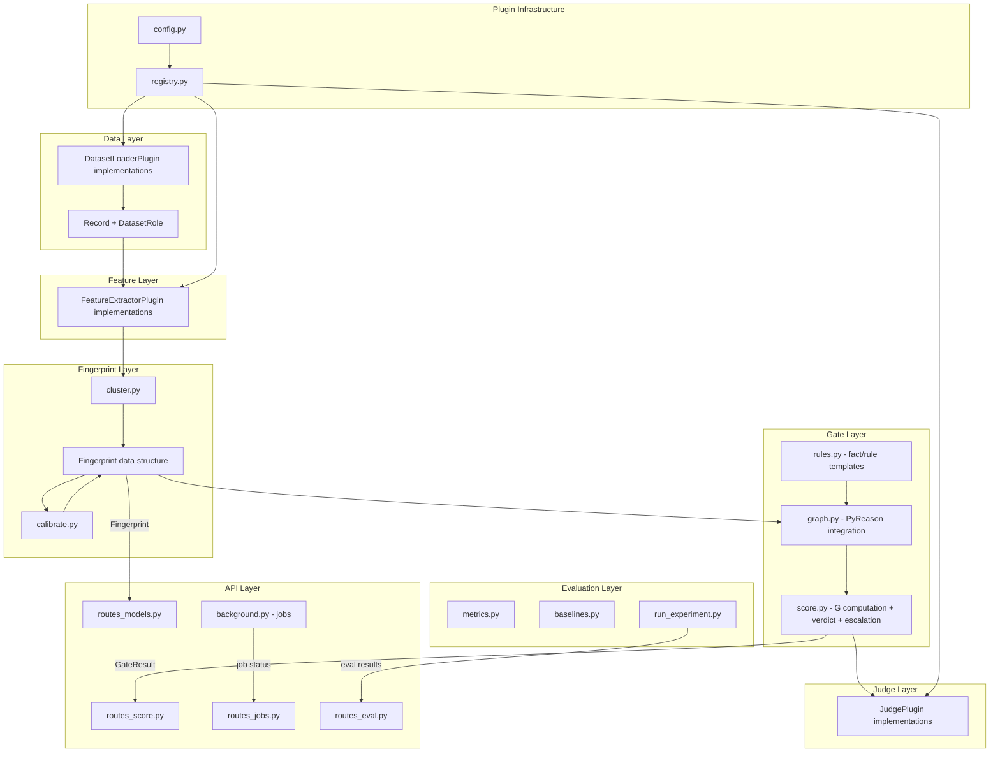

# PHASE B — ARCHITECTURE PROPOSAL

**Date**: 2026-08-29  
**Phase**: B — Architecture  
**Role**: Principal Architect + Research Lead  
**Spec Reference**: [Claude Text v2.md](file:///home/rishil-n/Documents/Interview%20Perp/Claude%20Text%20v2.md) (to be copied into workspace as `docs/Hallucination_Fingerprinting_Master_Spec_v2.md`)

---

## 1. Architecture for This Milestone

This is the **full project build** — every milestone from data ingestion through frontend — in the spec's mandated order ([Section 7, L412–424](file:///home/rishil-n/Documents/Interview%20Perp/Claude%20Text%20v2.md#L412-L424)). No milestone may be started before its predecessor is complete and tested.

### Milestone Map


---

### M0 — Prerequisites (environment setup)

| Attribute | Detail |
|---|---|
| **Responsibility** | Unblock all implementation by resolving the 4 confirmed blockers from Phase A |
| **Actions** | 1) Copy spec into workspace. 2) Install `pip` via `apt`. 3) Create virtualenv with Python 3.10 if PyReason fails on 3.14. 4) `git init`. 5) Download datasets. 6) Create `pyproject.toml`, `.gitignore`, `.env.example`, `README.md`. |
| **Output** | A buildable, version-controlled repo scaffold with all spec-mandated directories and empty `__init__.py` files |
| **Tests** | `python -c "import pyreason"` succeeds; datasets exist in `data/raw/`; `git log` shows initial commit |
| **Cost** | ~10 minutes human time (apt install + downloads) |

---

### M1 — Data Ingestion + Normalization

**Responsibility**: Load QA pairs from HaluEval, TruthfulQA, and SimpleQA into a uniform `Record` structure with correct `dataset_role` tagging.

**Files created** (per spec [Section 7, L366–369](file:///home/rishil-n/Documents/Interview%20Perp/Claude%20Text%20v2.md#L366-L369)):
- `backend/app/plugins/datasets/halueval_loader.py`
- `backend/app/plugins/datasets/truthfulqa_loader.py`
- `backend/app/plugins/datasets/simpleqa_loader.py`
- `backend/app/schemas.py` (initial — `Record`, `DatasetRole` enum)
- `backend/app/plugins/registry.py` (initial — `DatasetLoaderPlugin` protocol + registry dict)
- `backend/tests/test_data_ingestion.py`

**Data Structure — `Record`** (spec [5.1, L86](file:///home/rishil-n/Documents/Interview%20Perp/Claude%20Text%20v2.md#L86)):

```python
from enum import Enum
from pydantic import BaseModel

class DatasetRole(str, Enum):
    PRIMARY = "primary"
    SECONDARY = "secondary"

class Record(BaseModel):
    question: str
    answer: str
    model_id: str
    label: int               # 0 = correct, 1 = hallucinated
    source_dataset: str       # "halueval_qa" | "truthfulqa" | "simpleqa"
    dataset_role: DatasetRole # REQUIRED on every record
```

**Interface — `DatasetLoaderPlugin`** (spec [5.12, L234–237](file:///home/rishil-n/Documents/Interview%20Perp/Claude%20Text%20v2.md#L234-L237)):

```python
from typing import Protocol, Iterable

class DatasetLoaderPlugin(Protocol):
    name: str
    def load(self) -> Iterable[Record]: ...
```

**Input/Output**:

| Loader | Input | `model_id` | `label` mapping | `dataset_role` |
|---|---|---|---|---|
| `HaluEvalQALoader` | `data/raw/qa_data.json` | `"chatgpt"` (HaluEval's generator) | correct_response → 0, hallucinated_response → 1 | `"primary"` |
| `TruthfulQALoader` | HuggingFace `truthfulqa/truthful_qa` | `"truthfulqa_reference"` | correct → 0, incorrect → 1 (factuality proxy, commented) | `"secondary"` |
| `SimpleQALoader` | HuggingFace / local file | per-record if available | dataset-specific mapping, documented at impl time | `"secondary"` |

**Failure modes**:
- Label schema mismatch (e.g., HaluEval format changes) → raise `DatasetSchemaError` with the offending field
- Missing `dataset_role` → `Record` validation rejects it (Pydantic `BaseModel` with `DatasetRole` as required field)
- Secondary data pooled into calibration → guarded by filter function + dedicated test

**Tests**:
1. `test_halueval_loader_tags_primary`: assert every record from HaluEval has `dataset_role == "primary"`
2. `test_truthfulqa_loader_tags_secondary`: assert every record has `dataset_role == "secondary"`
3. `test_record_rejects_missing_role`: assert `Record(...)` without `dataset_role` raises `ValidationError`
4. `test_primary_filter_excludes_secondary`: load both datasets, filter to `dataset_role == "primary"`, assert zero secondary records remain
5. `test_halueval_label_mapping`: for a known sample, assert correct/hallucinated maps to 0/1

**Computational cost**: Negligible — JSON/CSV parsing, ~10k records.

---

### M2 — Feature Extraction

**Responsibility**: Compute the six features H, S, C, E, D, M from raw answer text, deterministically, with no LLM call. Provide two plugin implementations.

**Files created** (per spec [Section 7, L360–362](file:///home/rishil-n/Documents/Interview%20Perp/Claude%20Text%20v2.md#L360-L362)):
- `backend/app/plugins/features/default_extractor.py`
- `backend/app/plugins/features/alt_extractor.py`
- `backend/tests/test_feature_extraction.py`

**Interface — `FeatureExtractorPlugin`** (spec [5.12, L224–227](file:///home/rishil-n/Documents/Interview%20Perp/Claude%20Text%20v2.md#L224-L227)):

```python
class FeatureExtractorPlugin(Protocol):
    name: str
    def extract(self, answer: str) -> dict[str, float]: ...
    # Returns exactly {"H": float, "S": float, "C": float, "E": float, "D": float, "M": float}
```

**Feature Definitions** (spec [5.3, L97–104](file:///home/rishil-n/Documents/Interview%20Perp/Claude%20Text%20v2.md#L97-L104)):

| Feature | Key | Definition | Method | Dependencies |
|---|---|---|---|---|
| Hedge density | `"H"` | hedge-phrase count / 100 words | Lexicon match against a curated list ("might", "perhaps", "it is possible", "could be", etc.) | None (pure Python) |
| Specificity | `"S"` | (named entities + numbers/dates) / total tokens | `spacy` NER (`en_core_web_sm`) + regex for dates/numbers | `spacy` |
| Citation vagueness | `"C"` | source-gesturing phrases not followed by a named source within N tokens | Pattern match ("according to", "studies show", "research suggests") + N-token proximity check for a proper noun/URL | `spacy` (for NER proximity) |
| Evidence density | `"E"` | concrete factual assertions per sentence | Entity + relation co-occurrence heuristic (sentences containing ≥1 entity + ≥1 verb + ≥1 number/date = "evidenced") | `spacy` |
| Semantic/entity drift | `"D"` | embedding-similarity variance across sentences | Sentence embeddings via `sentence-transformers` (`all-MiniLM-L6-v2`), pairwise cosine similarity, then 1 − mean(cosines) = drift | `sentence-transformers` |
| Confidence-marker density | `"M"` | absolute/confidence words / 100 words | Lexicon match ("definitely", "certainly", "clearly", "without a doubt", etc.) | None (pure Python) |

**`DefaultFeatureExtractor`** implements all six. **`AltFeatureExtractor`** uses an alternative lexicon for H and M (e.g., expanded hedging list, synonym-based) to prove the plugin interface is real (spec [L240](file:///home/rishil-n/Documents/Interview%20Perp/Claude%20Text%20v2.md#L240)).

**Output**: `dict[str, float]` with exactly the six keys. Values are raw (unnormalized). Per-model `[0,1]` normalization happens later in the fingerprint/calibration stage (spec [5.3, L106](file:///home/rishil-n/Documents/Interview%20Perp/Claude%20Text%20v2.md#L106)).

**Failure modes**:
- Empty answer → return all zeros, no crash
- Single-sentence answer → D (drift) returns 0.0 (no inter-sentence comparison possible)
- spaCy model not downloaded → raise `DependencyError("Run: python -m spacy download en_core_web_sm")`
- sentence-transformers model not cached → first call downloads; document this

**Tests**:
1. `test_hedge_density_known_sentence`: "It might perhaps be possible that..." → H ≥ 0.03
2. `test_specificity_with_entities`: "Barack Obama was born on August 4, 1961 in Honolulu" → S > 0
3. `test_citation_vagueness_source_gesturing`: "According to studies, this is true" → C > 0
4. `test_evidence_density_factual`: "The GDP of France was $2.7 trillion in 2023" → E > 0
5. `test_drift_identical_sentences`: repeated sentence → D ≈ 0.0
6. `test_drift_divergent_sentences`: unrelated sentences → D > 0.3
7. `test_confidence_markers`: "This is definitely, absolutely correct" → M > 0
8. `test_output_keys_exact`: assert `set(result.keys()) == {"H", "S", "C", "E", "D", "M"}`
9. `test_alt_extractor_same_keys`: `AltFeatureExtractor` returns same key set
10. `test_empty_answer_no_crash`: empty string → returns dict with all zeros

**Computational cost**: ~50ms per answer (spaCy + sentence embedding forward pass). For 10k records: ~8 minutes. D is the bottleneck (embedding model inference).

---

### M3 — Baselines 1 and 4

**Responsibility**: Get the evaluation harness running end-to-end before any novel component exists (spec [L416](file:///home/rishil-n/Documents/Interview%20Perp/Claude%20Text%20v2.md#L416)).

**Files created** (per spec [Section 7, L401–404](file:///home/rishil-n/Documents/Interview%20Perp/Claude%20Text%20v2.md#L401-L404)):
- `eval/metrics.py` — metric computation functions
- `eval/baselines.py` — baseline classifiers
- `eval/run_experiment.py` — harness entrypoint

**Baselines implemented** (spec [Section 6, L312–318](file:///home/rishil-n/Documents/Interview%20Perp/Claude%20Text%20v2.md#L312-L318)):

| Baseline | # | Behavior |
|---|---|---|
| Always-escalate | 1 | Every answer → `RESOLVED_AMBIGUOUS`, `resolved_by = "llm_judge"` |
| Random/majority-class | 4 | Random binary (seeded) or always-predict-majority-class |

**Metrics** (spec [Section 6, L331](file:///home/rishil-n/Documents/Interview%20Perp/Claude%20Text%20v2.md#L331)):

```python
# eval/metrics.py
def compute_auroc(labels: list[int], scores: list[float]) -> float: ...
def compute_auprc(labels: list[int], scores: list[float]) -> float: ...
def compute_ece(labels: list[int], probs: list[float], n_bins: int = 10) -> float: ...
def compute_escalation_rate(verdicts: list[str]) -> float: ...
```

**Output**: JSON file written to `eval/results/` with config hash, timestamp, metrics per model, and the baseline name. This is the format `/api/v1/eval/summary` will later read.

**Tests**:
1. `test_auroc_perfect_classifier`: known labels/scores → AUROC = 1.0
2. `test_always_escalate_rate_is_1`: escalation rate == 1.0
3. `test_random_baseline_auroc_near_05`: AUROC ≈ 0.5 (±0.1)
4. `test_results_written_to_eval_dir`: check file exists after run

**Computational cost**: Negligible — no model inference.

---

### M4 — Fingerprint Clustering (Stage 1)

**Responsibility**: Per-model k-means/GMM clustering of labeled feature vectors into hallucination/correct style regions (spec [5.4, L108–110](file:///home/rishil-n/Documents/Interview%20Perp/Claude%20Text%20v2.md#L108-L110)). Produces the `Fingerprint` data structure.

**Files created** (per spec [Section 7, L370–372](file:///home/rishil-n/Documents/Interview%20Perp/Claude%20Text%20v2.md#L370-L372)):
- `backend/app/fingerprint/cluster.py`
- `backend/app/fingerprint/calibrate.py` (initial — normalization params only; thresholds added in M6)
- `backend/tests/test_fingerprint.py`

**Data Structure — `Fingerprint`**:

```python
from pydantic import BaseModel

class NormalizationParams(BaseModel):
    """Per-feature min/max from training set, used for [0,1] normalization."""
    feature_mins: dict[str, float]  # {"H": 0.0, "S": 0.01, ...}
    feature_maxs: dict[str, float]  # {"H": 0.12, "S": 0.45, ...}

class ClusterInfo(BaseModel):
    centroids: list[dict[str, float]]  # each centroid is {"H": .., "S": .., ...}
    cluster_labels: list[str]          # e.g., ["hallucination_region", "correct_region"]

class Fingerprint(BaseModel):
    model_id: str
    version: str                       # ISO timestamp or semantic version
    normalization: NormalizationParams
    clusters: ClusterInfo
    w_i: dict[str, float] | None       # rule weights — None until M6 calibration
    t_low: float | None                # None until M6 calibration
    t_high: float | None               # None until M6 calibration
    calibration_dataset_size: int
    last_calibrated_at: str            # ISO timestamp
```

**Process**:
1. Filter records to `dataset_role == "primary"` only
2. Extract raw features for all records of a given `model_id`
3. Compute per-model normalization params (min/max per feature from the training split)
4. Normalize features to `[0,1]` using those params
5. Run k-means (k=2 initially: hallucination cluster vs. correct cluster) on normalized vectors
6. Serialize to JSON file: `data/processed/fingerprints/{model_id}_v{version}.json`

**Input**: `list[Record]` (primary only) + `FeatureExtractorPlugin`  
**Output**: `Fingerprint` (persisted as JSON)

**Failure modes**:
- Fewer than `2 * k` samples for a model → raise `InsufficientDataError`
- All features identical (zero variance) → normalization produces division-by-zero → clamp to 0.0
- Unknown `model_id` at scoring time → explicit refusal, not silent fallback (spec [Section 9, L449](file:///home/rishil-n/Documents/Interview%20Perp/Claude%20Text%20v2.md#L449))

**Tests**:
1. `test_clustering_produces_two_centroids`: k=2 → 2 centroids in output
2. `test_normalization_bounds`: all normalized values in `[0,1]`
3. `test_fingerprint_serialization_roundtrip`: save → load → values identical
4. `test_primary_only_filter`: ensure no secondary records used
5. `test_insufficient_data_raises`: <4 records → `InsufficientDataError`

**Computational cost**: k-means on 6D vectors, ~5k samples per model → <1 second.

---

### M5 — Global-Threshold Gate (Baseline 3)

**Responsibility**: Implement the symbolic rule graph with a **single global** `(T_L, T_H, w_i)` pooled across all models. This is the ablation baseline (spec [Section 6, L316](file:///home/rishil-n/Documents/Interview%20Perp/Claude%20Text%20v2.md#L316)) that the core contribution must outperform.

**Files created** (per spec [Section 7, L373–376](file:///home/rishil-n/Documents/Interview%20Perp/Claude%20Text%20v2.md#L373-L376)):
- `backend/app/gate/rules.py` — PyReason fact/rule definitions
- `backend/app/gate/graph.py` — PyReason graph construction + inference
- `backend/app/gate/score.py` — `G` computation + verdict logic

**Data Structure — `GateResult`** (matches spec [5.8, L151](file:///home/rishil-n/Documents/Interview%20Perp/Claude%20Text%20v2.md#L151) and [5.12, L182–193](file:///home/rishil-n/Documents/Interview%20Perp/Claude%20Text%20v2.md#L182-L193)):

```python
class TriggeredPattern(BaseModel):
    name: str                      # e.g., "anomaly_pattern_1"
    features_involved: list[str]   # e.g., ["H", "C"]
    strength: float                # r_i for this pattern

class Thresholds(BaseModel):
    t_low: float
    t_high: float

class GateResult(BaseModel):
    verdict: str           # "LOW_RISK" | "HIGH_RISK" | "RESOLVED_AMBIGUOUS"
    gate_score: float      # G
    thresholds: Thresholds
    resolved_by: str       # "gate" | "llm_judge"
    triggered_patterns: list[TriggeredPattern]
    feature_breakdown: dict[str, float]  # {"H": .., "S": .., "C": .., "E": .., "D": .., "M": ..}
    explanation: str
    explanation_source: str  # "symbolic" | "llm_judge"
    model_id: str
    fingerprint_version: str
```

**PyReason Rule Graph** (spec [5.5, L116–129](file:///home/rishil-n/Documents/Interview%20Perp/Claude%20Text%20v2.md#L116-L129)):

```python
# backend/app/gate/rules.py

FACT_TEMPLATES = {
    "hedging_high":      ("H", "upper"),   # feature key, which bound triggers
    "specificity_high":  ("S", "upper"),
    "citation_vague":    ("C", "upper"),
    "evidence_low":      ("E", "lower"),   # low evidence = high anomaly
    "confidence_high":   ("M", "upper"),
    "entity_drift_high": ("D", "upper"),
}

RULE_TEMPLATES = {
    "anomaly_pattern_1": ["hedging_high", "citation_vague"],
    "anomaly_pattern_2": ["specificity_high", "evidence_low"],
    "anomaly_pattern_3": ["confidence_high", "entity_drift_high"],
}
```

> [!IMPORTANT]
> **ADR-1: Extracting `r_i` from PyReason bounds.**  
> PyReason returns `[lower, upper]` bounds for each rule conclusion. We define `r_i = lower` (the conservative, guaranteed activation strength). Rationale: using the lower bound means we only count activation that PyReason is confident about. This is documented in `decisions.md` and can be ablated against `r_i = upper` or `r_i = (lower + upper) / 2`.

**Verdict logic** (spec [5.6, L138–142](file:///home/rishil-n/Documents/Interview%20Perp/Claude%20Text%20v2.md#L138-L142)):

```python
def classify(G: float, t_low: float, t_high: float) -> str:
    if G < t_low:
        return "LOW_RISK"
    elif G > t_high:
        return "HIGH_RISK"
    else:
        return "AMBIGUOUS"  # internal only — becomes RESOLVED_AMBIGUOUS after judge
```

**Global calibration** (Baseline 3): Pool all models' primary data, fit a single `(T_L, T_H)` and uniform `w_i` via grid search optimizing AUROC on the validation split.

**Tests**:
1. `test_pyreason_graph_constructs`: graph builds without error
2. `test_known_anomalous_input`: high H + high C → `anomaly_pattern_1` fires, G > 0
3. `test_known_clean_input`: low all features → G ≈ 0, verdict `LOW_RISK`
4. `test_verdict_boundaries`: G exactly at T_L → `AMBIGUOUS`; G exactly at T_H → `AMBIGUOUS`
5. `test_gate_result_field_names`: assert output matches `GateResult` schema exactly
6. `test_global_calibration_runs`: grid search completes without error

**Computational cost**: PyReason inference ~10ms per answer. Grid search over ~100 threshold combinations × 5k validation samples → ~30 seconds.

---

### M6 — Adaptive Per-Model Gate (Core Contribution)

**Responsibility**: Replace the global threshold with **per-model** `(T_L, T_H, w_i)`. This is the central falsifiable hypothesis (spec [Section 4, L72–76](file:///home/rishil-n/Documents/Interview%20Perp/Claude%20Text%20v2.md#L72-L76)).

**Files modified**:
- `backend/app/fingerprint/calibrate.py` — extended to write per-model `w_i`, `t_low`, `t_high` into the `Fingerprint`
- `backend/app/gate/score.py` — loads per-model fingerprint instead of global params

**Process**:
1. For each `model_id` with sufficient primary data:
   a. Split primary records into train (60%) / validation (20%) / test (20%), stratified by label, with fixed seed
   b. Extract + normalize features using the model's own `NormalizationParams` from M4
   c. Grid/Bayesian search over `w_i` (per-rule weights, constrained to sum to 1) and `(T_L, T_H)` on the validation split
   d. Objective: maximize AUROC subject to escalation rate ≤ target (e.g., 30%)
   e. Write `w_i`, `t_low`, `t_high` into the model's `Fingerprint` and re-serialize

> [!IMPORTANT]
> **ADR-2: Train/Validation/Test split strategy.**  
> Split is 60/20/20, stratified by label, per model, with `seed=42`. The test split is NEVER used during calibration — only in M8 (full evaluation). This is the single most important leakage guard. The split indices are persisted in `data/processed/splits/{model_id}_split.json` for reproducibility.

**Failure modes**:
- Model with <50 primary samples → skip calibration, log warning, leave `w_i`/`t_low`/`t_high` as None → scoring for this model raises `UncalibratedModelError`
- Calibration finds T_L ≥ T_H → widen: set T_H = T_L + 0.05 (minimum ambiguous band), log warning

**Tests**:
1. `test_per_model_thresholds_differ`: calibrate ≥2 models → their `(T_L, T_H)` are not identical
2. `test_calibration_uses_validation_only`: mock the split, assert test indices never accessed
3. `test_weights_sum_to_one`: `sum(w_i.values()) ≈ 1.0`
4. `test_fingerprint_updated_with_calibration`: after calibration, `Fingerprint.t_low` is not None
5. `test_split_reproducibility`: same seed → same split indices

**Computational cost**: Grid search per model ~30 seconds × N models.

---

### M7 — Judge Escalation (Stage 3)

**Responsibility**: Implement `MockJudgePlugin` and `GeminiJudgePlugin`. Wire escalation logic: invoke judge ONLY when verdict is `AMBIGUOUS` (spec [5.7, L144–147](file:///home/rishil-n/Documents/Interview%20Perp/Claude%20Text%20v2.md#L144-L147)).

**Files created** (per spec [Section 7, L363–365](file:///home/rishil-n/Documents/Interview%20Perp/Claude%20Text%20v2.md#L363-L365)):
- `backend/app/plugins/judges/mock_judge.py`
- `backend/app/plugins/judges/gemini_judge.py`

**Interface — `JudgePlugin`** (spec [5.12, L229–232](file:///home/rishil-n/Documents/Interview%20Perp/Claude%20Text%20v2.md#L229-L232)):

```python
class JudgeResult(BaseModel):
    verdict: str           # "LOW_RISK" | "HIGH_RISK"  (judge's resolved direction)
    explanation: str       # natural-language reasoning, labeled as model-generated
    confidence: float      # judge's self-reported confidence [0,1]

class JudgePlugin(Protocol):
    name: str
    def judge(
        self,
        answer: str,
        fingerprint_summary: dict,
        ambiguous_patterns: list[dict],
    ) -> JudgeResult: ...
```

**`MockJudgePlugin`** (spec [L241](file:///home/rishil-n/Documents/Interview%20Perp/Claude%20Text%20v2.md#L241)):
- Returns deterministic canned response: `verdict="HIGH_RISK"`, `explanation="Mock judge: deterministic test response"`, `confidence=0.5`
- Default in tests and local dev without API key

**`GeminiJudgePlugin`**:
- Calls `google.generativeai` with `temperature=0` (reproducibility)
- Prompt includes: the answer text, the model's fingerprint summary (centroid positions, `T_L`/`T_H`), and specifically which rules produced the ambiguous activation
- Parses structured JSON response
- API key loaded from `GEMINI_API_KEY` environment variable, never logged or returned

**Escalation wiring in `gate/score.py`**:

```python
def score_answer(answer: str, model_id: str, ...) -> GateResult:
    features = extractor.extract(answer)
    normalized = normalize(features, fingerprint.normalization)
    G, patterns = run_gate(normalized, fingerprint)
    verdict = classify(G, fingerprint.t_low, fingerprint.t_high)

    if verdict == "AMBIGUOUS":
        judge_result = judge.judge(answer, fingerprint.summary(), patterns)
        return GateResult(
            verdict="RESOLVED_AMBIGUOUS",
            gate_score=G,
            resolved_by="llm_judge",
            explanation=judge_result.explanation,
            explanation_source="llm_judge",
            ...
        )
    else:
        return GateResult(
            verdict=verdict,  # "LOW_RISK" or "HIGH_RISK"
            gate_score=G,
            resolved_by="gate",
            explanation=f"Gate score {G:.3f} {'below' if verdict == 'LOW_RISK' else 'above'} "
                        f"this model's {'lower' if verdict == 'LOW_RISK' else 'upper'} threshold",
            explanation_source="symbolic",
            ...
        )
```

**Tests**:
1. `test_mock_judge_deterministic`: same inputs → same output
2. `test_escalation_only_on_ambiguous`: LOW_RISK/HIGH_RISK → judge never called (mock with call counter)
3. `test_ambiguous_triggers_judge`: G in (T_L, T_H) → judge called exactly once
4. `test_resolved_ambiguous_verdict`: after judge → verdict is `"RESOLVED_AMBIGUOUS"`
5. `test_resolved_by_field`: gate-resolved → `"gate"`; judge-resolved → `"llm_judge"`
6. `test_explanation_source_field`: gate → `"symbolic"`; judge → `"llm_judge"`

**Computational cost**: MockJudge ~0ms. GeminiJudge ~1–3 seconds per call (API latency).

---

### M8 — Full Evaluation

**Responsibility**: Run the core experiment (adaptive vs. global), all 5 baselines, ablations, and sensitivity analysis (spec [Section 6, L308–339](file:///home/rishil-n/Documents/Interview%20Perp/Claude%20Text%20v2.md#L308-L339)). Write results to a location `/api/v1/eval/summary` can read.

**Files modified/created**:
- `eval/baselines.py` — add baselines 2 (never-escalate), 3 (global gate from M5), 5 (TRACT-style)
- `eval/run_experiment.py` — full experiment harness
- `eval/results/*.json` — output metrics

**Experiments** (all on the held-out **test** split):

| Experiment | Description |
|---|---|
| Baseline 1 | Always-escalate (from M3) |
| Baseline 2 | Never-escalate / gate-only (gate with no judge, AMBIGUOUS → HIGH_RISK) |
| Baseline 3 | Global `(T_L, T_H, w_i)` from M5 |
| Baseline 4 | Random/majority-class (from M3) |
| Baseline 5 | Pooled lexical classifier (H+M features only, logistic regression) |
| **Core** | Adaptive per-model `(T_L, T_H, w_i)` from M6 |
| Ablation A | Feature-subset ablation (drop each feature one at a time) |
| Ablation B | Learned `w_i` vs. uniform `w_i = 1/3` |
| Ablation C | Cluster-count sensitivity (k=2, 3, 4) |
| Sensitivity | Vary training-set size per model (10%, 25%, 50%, 75%, 100%) |

**Output format** (designed for `/api/v1/eval/summary` consumption):

```json
{
  "experiment_id": "exp_20260829_143000",
  "config_hash": "abc123",
  "seed": 42,
  "per_model": {
    "chatgpt": {
      "auroc": 0.87,
      "auprc": 0.82,
      "ece": 0.04,
      "escalation_rate": 0.23,
      "latency_ms_mean": 52,
      "method": "adaptive"
    }
  },
  "baselines": {
    "global_threshold": { "auroc": 0.79, ... },
    "always_escalate": { "auroc": 0.91, "escalation_rate": 1.0, ... },
    ...
  },
  "ablations": { ... }
}
```

**Reproducibility**: Fixed `seed=42`, versioned split files, config hash logged, code commit hash in output.

**Tests**:
1. `test_experiment_output_schema`: output JSON validates against expected schema
2. `test_reproducibility_same_seed`: run twice with seed=42 → identical metrics
3. `test_all_baselines_present`: output contains all 5 baseline names

**Computational cost**: Feature extraction on test set (~2k samples) ~3 minutes. Gate inference ~20 seconds. Total ~5 minutes per experiment configuration.

---

### M9 — FastAPI Backend

**Responsibility**: Wrap the working pipeline in HTTP routes per the exact contract in spec [5.12, L180–216](file:///home/rishil-n/Documents/Interview%20Perp/Claude%20Text%20v2.md#L180-L216).

**Files created** (per spec [Section 7, L349–379](file:///home/rishil-n/Documents/Interview%20Perp/Claude%20Text%20v2.md#L349-L379)):
- `backend/app/main.py`
- `backend/app/api/routes_score.py`
- `backend/app/api/routes_models.py`
- `backend/app/api/routes_jobs.py`
- `backend/app/api/routes_eval.py`
- `backend/app/jobs/background.py`
- `backend/app/config.py`
- `backend/tests/test_api.py`

**Contract verification** (every field name and enum value matched against spec [L180–216](file:///home/rishil-n/Documents/Interview%20Perp/Claude%20Text%20v2.md#L180-L216)):

| Endpoint | Method | Request | Response Key Fields |
|---|---|---|---|
| `/api/v1/score` | POST | `{"answer": str, "model_id": str}` | `verdict`, `gate_score`, `thresholds.t_low`, `thresholds.t_high`, `resolved_by`, `triggered_patterns[].name`, `triggered_patterns[].features_involved`, `triggered_patterns[].strength`, `feature_breakdown.{H,S,C,E,D,M}`, `explanation`, `explanation_source`, `model_id`, `fingerprint_version` |
| `/api/v1/models` | GET | — | `[{model_id, fingerprint_version, calibration_dataset_size, last_calibrated_at}]` |
| `/api/v1/models/{model_id}/fingerprint` | GET | — | centroids, `t_low`, `t_high`, `w_i` |
| `/api/v1/models/{model_id}/calibrate` | POST | — | `{"job_id": str}` |
| `/api/v1/jobs/{job_id}` | GET | — | `{"status": "pending"\|"running"\|"complete"\|"failed", "result": ...}` |
| `/api/v1/eval/summary` | GET | — | reads from `eval/results/` |
| `/api/v1/health` | GET | — | `{"status": "ok"}` |

**Enum values** (exact strings from spec):
- `verdict`: `"LOW_RISK"` \| `"HIGH_RISK"` \| `"RESOLVED_AMBIGUOUS"`
- `resolved_by`: `"gate"` \| `"llm_judge"`
- `explanation_source`: `"symbolic"` \| `"llm_judge"`
- `status` (jobs): `"pending"` \| `"running"` \| `"complete"` \| `"failed"`

**Background jobs** (spec [L175](file:///home/rishil-n/Documents/Interview%20Perp/Claude%20Text%20v2.md#L175)):
- `/calibrate` triggers a background thread (not a queue — scope is demo, not production)
- In-memory dict `{job_id: {status, result}}`
- Guard: reject `/calibrate` if a job for that `model_id` is already running (spec [L453](file:///home/rishil-n/Documents/Interview%20Perp/Claude%20Text%20v2.md#L453))

**Cold-start handling** (spec [Section 9, L449](file:///home/rishil-n/Documents/Interview%20Perp/Claude%20Text%20v2.md#L449)):
- `/score` with unknown `model_id` → HTTP 404 with `{"error": "No calibrated fingerprint for model '{model_id}'. Run /models/{model_id}/calibrate first."}`
- Never silently apply another model's thresholds

**Tests**:
1. `test_score_valid_request`: POST valid payload → 200 + correct schema
2. `test_score_unknown_model`: unknown model_id → 404
3. `test_models_list`: GET /models → list of calibrated models
4. `test_fingerprint_endpoint`: GET /models/{id}/fingerprint → correct structure
5. `test_calibrate_returns_job_id`: POST /calibrate → 202 + `{"job_id": ...}`
6. `test_calibrate_rejects_duplicate`: second calibrate while running → 409
7. `test_health`: GET /health → 200
8. `test_score_response_field_names`: every field name matches spec exactly
9. `test_verdict_enum_values`: only the 3 specified values appear

**Computational cost**: API overhead negligible. Scoring latency dominated by feature extraction (~50ms) + gate (~10ms) + potential judge (~2s if escalated).

---

### M10 — Frontend

**Responsibility**: Build the React + Tailwind frontend with Signal Forensics design tokens, in page order (spec [5.13, L289–294](file:///home/rishil-n/Documents/Interview%20Perp/Claude%20Text%20v2.md#L289-L294)).

**Files created** (per spec [Section 7, L381–397](file:///home/rishil-n/Documents/Interview%20Perp/Claude%20Text%20v2.md#L381-L397)):

```
frontend/
  src/
    pages/ScoreResponse.tsx
    pages/ModelFingerprints.tsx
    pages/Evaluation.tsx
    components/FingerprintRadar.tsx
    components/VerdictBand.tsx
    components/FeatureBar.tsx
    components/Disclaimer.tsx
    lib/api.ts
    lib/tokens.ts
    styles/tailwind.config.ts
```

**Design token verification** (spec [5.13, L259–274](file:///home/rishil-n/Documents/Interview%20Perp/Claude%20Text%20v2.md#L259-L274)):

```typescript
// lib/tokens.ts — single source of truth
export const tokens = {
  colors: {
    'graphite-950': '#0B0D10',
    'graphite-800': '#14171C',
    'graphite-600': '#262B33',
    'paper-100':    '#E8EAED',
    'paper-400':    '#8B93A1',
    'signal-teal':  '#4FE3C1',
    'signal-amber': '#F2B84B',
    'signal-coral': '#FF6B4A',
  },
  fonts: {
    display: 'Space Grotesk',  // headers only
    body:    'Inter',          // prose
    data:    'JetBrains Mono', // measured values only
  },
} as const;
```

**`tailwind.config.ts`** extends Tailwind with these exact tokens — does NOT use default Tailwind palette.

**Component responsibilities**:

| Component | Data Source | Renders |
|---|---|---|
| `FingerprintRadar` | `feature_breakdown` + fingerprint centroids | 6-axis polar plot with ridge-line effect, verdict-colored answer overlay |
| `VerdictBand` | `gate_score`, `thresholds.t_low`, `thresholds.t_high` | G plotted on a horizontal line between T_L and T_H |
| `FeatureBar` | `feature_breakdown` per feature | Horizontal bar per feature with calibrated normal range |
| `Disclaimer` | Static text | Persistent research-demo disclaimer (not dismissible) |

**Page build order** (spec [L423](file:///home/rishil-n/Documents/Interview%20Perp/Claude%20Text%20v2.md#L423)):
1. **Score a Response** (home) — calls `POST /api/v1/score`, renders scan-report layout
2. **Model Fingerprints** — calls `GET /api/v1/models` + `GET /api/v1/models/{model_id}/fingerprint`
3. **Evaluation** — calls `GET /api/v1/eval/summary`
4. **Disclaimer** — static, persistent

**Fingerprint Radar motion** (spec [L287](file:///home/rishil-n/Documents/Interview%20Perp/Claude%20Text%20v2.md#L287)): stroke-by-stroke draw over 600–800ms on verdict resolve. Respect `prefers-reduced-motion` → instant render.

**Tests**:
1. Component renders without crash (smoke tests)
2. `FingerprintRadar` renders 6 axes
3. API client correctly types all response fields
4. Design tokens match spec values exactly (snapshot test on `tokens.ts`)

---

### M11 — Documentation

- Update `README.md` with setup instructions, architecture overview, how to run
- Populate `docs/decisions.md` with all ADRs accumulated during implementation
- Final pass on spec file in workspace

---

## 2. Module Boundaries



**Key boundary rules**:
- The **API layer** NEVER contains pipeline logic — it only calls `score.py`, reads fingerprint files, reads eval results, and manages jobs
- The **Frontend** NEVER calls pipeline logic — it only calls the API
- **Plugin selection** happens in `config.py` → `registry.py`, not in call sites
- The **Evaluation layer** is standalone — it imports the pipeline modules directly (not via the API) for benchmarking

---

## 3. Interfaces (Exact Signatures)

All interfaces verified against spec [5.12, L223–237](file:///home/rishil-n/Documents/Interview%20Perp/Claude%20Text%20v2.md#L223-L237):

```python
# ── Data ──
class Record(BaseModel):
    question: str
    answer: str
    model_id: str
    label: int                    # 0 = correct, 1 = hallucinated
    source_dataset: str           # "halueval_qa" | "truthfulqa" | "simpleqa"
    dataset_role: DatasetRole     # "primary" | "secondary"

# ── Plugins ──
class FeatureExtractorPlugin(Protocol):
    name: str
    def extract(self, answer: str) -> dict[str, float]: ...

class JudgePlugin(Protocol):
    name: str
    def judge(self, answer: str, fingerprint_summary: dict, ambiguous_patterns: list[dict]) -> JudgeResult: ...

class DatasetLoaderPlugin(Protocol):
    name: str
    def load(self) -> Iterable[Record]: ...

# ── Core Data Structures ──
class Fingerprint(BaseModel):
    model_id: str
    version: str
    normalization: NormalizationParams      # {feature_mins, feature_maxs}
    clusters: ClusterInfo                    # {centroids, cluster_labels}
    w_i: dict[str, float] | None            # {"anomaly_pattern_1": 0.4, ...}
    t_low: float | None
    t_high: float | None
    calibration_dataset_size: int
    last_calibrated_at: str

class GateResult(BaseModel):
    verdict: str                             # "LOW_RISK" | "HIGH_RISK" | "RESOLVED_AMBIGUOUS"
    gate_score: float                        # G
    thresholds: Thresholds                   # {t_low, t_high}
    resolved_by: str                         # "gate" | "llm_judge"
    triggered_patterns: list[TriggeredPattern]
    feature_breakdown: dict[str, float]      # {"H", "S", "C", "E", "D", "M"}
    explanation: str
    explanation_source: str                  # "symbolic" | "llm_judge"
    model_id: str
    fingerprint_version: str
```

---

## 4. Data Flow

```
Answer text + model_id
        │
        ▼
┌─────────────────────┐
│ FeatureExtractorPlugin│ → {"H": 0.08, "S": 0.32, "C": 0.65, "E": 0.21, "D": 0.44, "M": 0.12}
└─────────────────────┘
        │
        ▼
┌─────────────────────┐
│  Normalize [0,1]    │ ← uses Fingerprint.normalization (per-model min/max)
└─────────────────────┘
        │
        ▼
┌─────────────────────┐
│  PyReason Graph     │ ← annotated bounds on facts → rule activations
│  rules.py + graph.py│   r_i = lower bound of each rule conclusion
└─────────────────────┘
        │
        ▼
┌─────────────────────┐
│  G = Σ w_i * r_i    │ ← w_i from Fingerprint (per-model or global)
│  score.py           │
└─────────────────────┘
        │
        ├── G < T_L ──────→ GateResult(verdict="LOW_RISK", resolved_by="gate", explanation_source="symbolic")
        │
        ├── G > T_H ──────→ GateResult(verdict="HIGH_RISK", resolved_by="gate", explanation_source="symbolic")
        │
        └── T_L ≤ G ≤ T_H ─→ JudgePlugin.judge(answer, fingerprint_summary, ambiguous_patterns)
                                    │
                                    ▼
                              GateResult(verdict="RESOLVED_AMBIGUOUS", resolved_by="llm_judge",
                                         explanation_source="llm_judge")
```

---

## 5. Error Handling

| Error | Layer | Response |
|---|---|---|
| Unknown `model_id` | `score.py` / API | `UncalibratedModelError` → HTTP 404 |
| Fingerprint not yet calibrated (`w_i` is None) | `score.py` | `UncalibratedModelError` → HTTP 404 |
| Empty answer text | `FeatureExtractorPlugin` | Return all-zero features, proceed normally |
| spaCy model missing | `DefaultFeatureExtractor.__init__` | `DependencyError` → HTTP 503 at startup |
| Gemini API key missing | `GeminiJudgePlugin.__init__` | Logged warning; if called, `JudgeUnavailableError` → HTTP 503 |
| Gemini API timeout/error | `GeminiJudgePlugin.judge` | `JudgeError` → gate returns `RESOLVED_AMBIGUOUS` with `explanation="Judge unavailable"` |
| Calibration job already running | `routes_models.py` | HTTP 409 Conflict |
| Dataset file not found | `DatasetLoaderPlugin.load` | `DatasetNotFoundError` with path |
| Insufficient data for calibration | `calibrate.py` | `InsufficientDataError` → job status `"failed"` |

---

## 6. Testing Strategy

### Unit Tests (per milestone, in `backend/tests/`)

Each milestone section above lists its specific tests. Total: ~45 unit tests.

### Integration Tests

1. **End-to-end pipeline test**: Load HaluEval sample → extract features → cluster → calibrate → score → verify GateResult schema
2. **API contract test**: Start FastAPI test client → hit every endpoint → verify response schemas and status codes
3. **Plugin swap test**: Register `AltFeatureExtractor` via config → score the same answer → verify output keys unchanged

### Research Validity Tests

1. **Leakage test**: Assert calibration code only accesses train+validation indices, never test
2. **dataset_role filter test**: Assert calibration only uses `dataset_role == "primary"` records
3. **Reproducibility test**: Run experiment twice with same seed → bit-identical metrics
4. **Correlation analysis**: Compute pairwise Pearson correlation between H, S, C, E, D, M on the training set — flag if |r| > 0.8

---

## 7. Configuration Strategy

**Plugin selection** via YAML (spec [L243](file:///home/rishil-n/Documents/Interview%20Perp/Claude%20Text%20v2.md#L243)):

```yaml
# configs/default.yaml
plugins:
  feature_extractor: "default"    # or "alt"
  judge: "mock"                   # or "gemini"
  dataset_loaders:
    - "halueval_qa"
    - "truthfulqa"
    - "simpleqa"

paths:
  fingerprints_dir: "data/processed/fingerprints"
  eval_results_dir: "eval/results"
  raw_data_dir: "data/raw"

experiment:
  seed: 42
  split_ratios: [0.6, 0.2, 0.2]   # train, val, test
  clustering_k: 2

gemini:
  # API key loaded from GEMINI_API_KEY env var, never in config file
  temperature: 0
  model: "gemini-2.0-flash"
```

**Registry** (`backend/app/plugins/registry.py`):

```python
_REGISTRY: dict[str, dict[str, type]] = {
    "feature_extractor": {},
    "judge": {},
    "dataset_loader": {},
}

def register(component: str, name: str, cls: type) -> None:
    _REGISTRY[component][name] = cls

def get(component: str, name: str) -> type:
    return _REGISTRY[component][name]

# Each plugin module self-registers at import time:
# register("feature_extractor", "default", DefaultFeatureExtractor)
```

**`config.py`** reads the YAML, imports and instantiates the named plugins. Call sites use `get_extractor()`, `get_judge()`, etc. — never direct imports of implementation classes.

---

## 8. Risks

| # | Risk | Mitigation |
|---|---|---|
| 1 | PyReason fails on Python 3.14 | Test immediately in M0. Fall back to Python 3.10 venv. |
| 2 | HaluEval has only 1 model_id → can't do per-model comparison | Inspect dataset in M1. If single-model, simulate multi-model by splitting by question category or using TruthfulQA models as secondary evaluation. |
| 3 | Feature D (drift) is slow on large datasets | Cache sentence embeddings after first extraction. Use `all-MiniLM-L6-v2` (fast, 384-dim). |
| 4 | Global baseline outperforms adaptive | This is a valid research result, not a bug. Report honestly in eval + UI (spec [L799–801](file:///home/rishil-n/Documents/Interview%20Perp/Claude%20Text%20v2.md#L799-L801)). |
| 5 | PyReason API changes | Pin version in `pyproject.toml`. Test graph construction in M5 before building on it. |
| 6 | Gemini API costs during development | MockJudge is default. Gemini only used in final M8 eval runs. |

---

## 9. ADR-Style Major Decisions

### ADR-1: Extracting `r_i` from PyReason Bounds

**Context**: PyReason returns `[lower, upper]` interval bounds for each rule conclusion. The spec defines `G = Σ w_i * r_i` but does not specify how `r_i` is derived from these bounds.  
**Decision**: `r_i = lower` (conservative, guaranteed activation).  
**Alternatives considered**: `upper` (optimistic), `(lower + upper) / 2` (midpoint).  
**Rationale**: The lower bound is what PyReason guarantees given the input facts. Using it makes G a conservative estimate. The midpoint and upper bound alternatives are documented as ablation candidates.  
**Status**: Proposed. To be recorded in `docs/decisions.md`.

### ADR-2: Train/Validation/Test Split

**Context**: Thresholds and weights are learned on validation data. Test data must be untouched until final evaluation.  
**Decision**: 60/20/20 stratified split per model, `seed=42`, indices persisted in `data/processed/splits/`.  
**Rationale**: Standard ML practice. Per-model splits ensure each model's calibration is independent. Persisted indices enable exact reproduction.  
**Status**: Proposed.

### ADR-3: Fingerprint Serialization Format

**Context**: Fingerprints must be versioned, serializable, and contain all per-model parameters.  
**Decision**: JSON files at `data/processed/fingerprints/{model_id}_v{version}.json`, validated by the `Fingerprint` Pydantic model.  
**Alternatives considered**: SQLite, pickle, protobuf.  
**Rationale**: JSON is human-readable, version-controllable, and sufficient for the data size. Pydantic provides schema validation on load.  
**Status**: Proposed.

### ADR-4: Per-Model Normalization Storage

**Context**: Features are normalized to `[0,1]` using per-model training-set statistics. These must be stored for inference.  
**Decision**: Normalization params (`feature_mins`, `feature_maxs`) are stored inside the `Fingerprint` object.  
**Rationale**: Keeps all per-model parameters in one serialized artifact. No separate normalization file to go out of sync.  
**Status**: Proposed.

### ADR-5: RESOLVED_AMBIGUOUS Semantics

**Context**: The spec returns `RESOLVED_AMBIGUOUS` as a verdict after judge escalation, but doesn't include a structured field for the judge's resolved direction.  
**Decision**: Accept the spec as-is. The `JudgeResult` internal type carries `verdict: "LOW_RISK" | "HIGH_RISK"`, but the API response exposes `RESOLVED_AMBIGUOUS` to signal transparency. The judge's directional conclusion is conveyed in the `explanation` field (natural language). If the user requests a structured direction field, it can be added as `resolved_direction` in a future spec revision.  
**Rationale**: Do not silently extend the API schema beyond what the spec defines (spec [L536–538](file:///home/rishil-n/Documents/Interview%20Perp/Claude%20Text%20v2.md#L536-L538)).  
**Status**: Proposed, pending user decision.

### ADR-6: Plugin Selection Mechanism

**Context**: Spec requires config-driven plugin selection, not hardcoded imports.  
**Decision**: YAML config file + simple dict-based registry with self-registration at import time. `config.py` reads the YAML and instantiates the named plugins.  
**Alternatives considered**: Entry points, importlib discovery, decorator-based registration.  
**Rationale**: Spec explicitly says "do not reach for a heavyweight plugin-discovery framework" (spec [L221](file:///home/rishil-n/Documents/Interview%20Perp/Claude%20Text%20v2.md#L221)). A dict is sufficient.  
**Status**: Proposed.

---

## 10. Exact Implementation Order Within This Milestone

```
M0.1  sudo apt-get install python3-pip
M0.2  pip install virtualenv; create venv
M0.3  pip install pyreason → test import → if fails, install Python 3.10
M0.4  Copy spec content into docs/Hallucination_Fingerprinting_Master_Spec_v2.md
M0.5  git init, .gitignore, initial commit
M0.6  Create pyproject.toml with all dependencies
M0.7  Create directory scaffold (all __init__.py files, empty modules)
M0.8  Download datasets into data/raw/
M0.9  pip install -e ".[dev]"
M0.10 Commit: "M0: project scaffold and environment"

M1.1  Implement Record + DatasetRole in schemas.py
M1.2  Implement DatasetLoaderPlugin protocol in registry.py
M1.3  Implement HaluEvalQALoader
M1.4  Write test_halueval_loader_tags_primary → make it pass
M1.5  Write test_primary_filter_excludes_secondary → make it pass
M1.6  Implement TruthfulQALoader
M1.7  Implement SimpleQALoader
M1.8  Write remaining M1 tests → all pass
M1.9  Commit: "M1: data ingestion with dataset_role filtering"

M2.1  Implement DefaultFeatureExtractor (H, M first — pure lexicon)
M2.2  Add S, C, E (spaCy-dependent)
M2.3  Add D (sentence-transformers-dependent)
M2.4  Write M2 tests → all pass
M2.5  Implement AltFeatureExtractor (alternate lexicon for H, M)
M2.6  Commit: "M2: feature extraction with default + alt plugins"

M3.1  Implement metrics.py (AUROC, AUPRC, ECE, escalation_rate)
M3.2  Implement baselines 1 and 4 in baselines.py
M3.3  Implement run_experiment.py harness
M3.4  Run baselines, write results to eval/results/
M3.5  Write M3 tests → all pass
M3.6  Commit: "M3: evaluation harness with baselines 1,4"

M4.1  Implement Fingerprint + NormalizationParams + ClusterInfo in schemas.py
M4.2  Implement cluster.py (per-model k-means)
M4.3  Implement initial calibrate.py (normalization only, no thresholds yet)
M4.4  Write M4 tests → all pass
M4.5  Commit: "M4: per-model fingerprint clustering"

M5.1  Implement rules.py (fact/rule templates)
M5.2  Implement graph.py (PyReason graph construction + inference)
M5.3  Implement score.py (G computation + classify + GateResult)
M5.4  Implement global threshold calibration in calibrate.py
M5.5  Add Baseline 3 to baselines.py, run it
M5.6  Write M5 tests → all pass
M5.7  Commit: "M5: global-threshold gate (Baseline 3)"

M6.1  Extend calibrate.py for per-model (T_L, T_H, w_i)
M6.2  Implement split persistence (data/processed/splits/)
M6.3  Update score.py to load per-model fingerprint
M6.4  Write M6 tests → all pass
M6.5  Commit: "M6: adaptive per-model gate (core contribution)"

M7.1  Implement MockJudgePlugin
M7.2  Implement JudgePlugin protocol + JudgeResult in registry.py/schemas.py
M7.3  Wire escalation logic in score.py
M7.4  Write M7 tests (mock only) → all pass
M7.5  Implement GeminiJudgePlugin
M7.6  Commit: "M7: judge escalation with mock + gemini plugins"

M8.1  Add baselines 2, 5 to baselines.py
M8.2  Run full experiment: adaptive vs. global vs. all baselines
M8.3  Run ablations (feature-subset, w_i, cluster-count)
M8.4  Run sensitivity analysis
M8.5  Write results to eval/results/ in API-consumable format
M8.6  Write M8 tests → all pass
M8.7  Commit: "M8: full evaluation and ablations"

M9.1  Implement config.py + registry wiring
M9.2  Implement main.py (FastAPI app)
M9.3  Implement routes_score.py
M9.4  Implement routes_models.py
M9.5  Implement routes_jobs.py + background.py
M9.6  Implement routes_eval.py
M9.7  Write M9 tests (httpx test client) → all pass
M9.8  Commit: "M9: FastAPI backend with exact API contract"

M10.1  npm create vite, install tailwind, configure tokens
M10.2  Implement lib/tokens.ts + tailwind.config.ts with exact hex values
M10.3  Implement lib/api.ts (typed client)
M10.4  Implement Disclaimer.tsx (persistent)
M10.5  Implement FeatureBar.tsx
M10.6  Implement VerdictBand.tsx
M10.7  Implement FingerprintRadar.tsx (with stroke animation + prefers-reduced-motion)
M10.8  Implement ScoreResponse.tsx page
M10.9  Implement ModelFingerprints.tsx page
M10.10 Implement Evaluation.tsx page
M10.11 Write M10 tests → all pass
M10.12 Commit: "M10: frontend with Signal Forensics design"

M11.1  Write README.md
M11.2  Populate docs/decisions.md with all ADRs
M11.3  Final commit: "M11: documentation"
```

**STOP — Phase B Architecture complete. Awaiting approval to begin implementation.**
